# Documentação Modelo Preditivo - Inteli

## MPG - Modelo Preditivo da Gazeta
### Grupo SapientIA
#### Ana Beatriz Passos Beggiato
#### David Deodato Nascimento
#### Gabriel Santos do Nascimento
#### Igor Sampaio
#### Luiza Faria Petenazzi
#### Otavio de Carvalho Vasconcelos
#### Vitor Balbo

## Sumário

[1. Introdução](#1-introduçãoa1)

[2. Objetivos e Justificativa](#2-objetivos-e-justificativa)

&nbsp;&nbsp;&nbsp;&nbsp;[2.1 Objetivos](#21-objetivos)

&nbsp;&nbsp;&nbsp;&nbsp;[2.2 Proposta de Solução](#22-proposta-de-solução)

[3. Metodologia](#3-metodologia)

&nbsp;&nbsp;&nbsp;&nbsp;[3.1. CRISP-DM](#31-crisp-dm)

[4. Desenvolvimento e Resultados](#4-desenvolvimento-e-resultados)

&nbsp;&nbsp;&nbsp;&nbsp;[4.1. Compreensão do Problema](#41-compreensão-do-problema)

&nbsp;&nbsp;&nbsp;&nbsp;&nbsp;&nbsp;&nbsp;&nbsp;[4.1.1. Contexto da indústria](#411-contexto-da-indústria)

&nbsp;&nbsp;&nbsp;&nbsp;&nbsp;&nbsp;&nbsp;&nbsp;&nbsp;&nbsp;&nbsp;&nbsp;[ 4.1.1.1. 5 Forças de Porter](#4111-5-forças-de-porter)

&nbsp;&nbsp;&nbsp;&nbsp;&nbsp;&nbsp;&nbsp;&nbsp;[4.1.2. Análise SWOT](#412-análise-swot)

&nbsp;&nbsp;&nbsp;&nbsp;&nbsp;&nbsp;&nbsp;&nbsp;[4.1.3. Planejamento Geral da Solução](#413-planejamento-geral-da-solução)

&nbsp;&nbsp;&nbsp;&nbsp;&nbsp;&nbsp;&nbsp;&nbsp;[4.1.4. Value Proposition Canvas](#414-value-proposition-canvas)

&nbsp;&nbsp;&nbsp;&nbsp;&nbsp;&nbsp;&nbsp;&nbsp;[4.1.5. Matrizes](#415-matrizes)

&nbsp;&nbsp;&nbsp;&nbsp;&nbsp;&nbsp;&nbsp;&nbsp;&nbsp;&nbsp;&nbsp;&nbsp;[4.1.5.1 Matriz de riscos](#4151-matriz-de-riscos)

&nbsp;&nbsp;&nbsp;&nbsp;&nbsp;&nbsp;&nbsp;&nbsp;&nbsp;&nbsp;&nbsp;&nbsp;[4.1.5.2 Matriz de Oportunidades](#4152-matriz-de-oportunidades)

&nbsp;&nbsp;&nbsp;&nbsp;&nbsp;&nbsp;&nbsp;&nbsp;[4.1.6. Personas](#416-personas)

&nbsp;&nbsp;&nbsp;&nbsp;&nbsp;&nbsp;&nbsp;&nbsp;&nbsp;&nbsp;&nbsp;&nbsp;[4.1.6.1. User Stories](#4161-user-stories)

&nbsp;&nbsp;&nbsp;&nbsp;&nbsp;&nbsp;&nbsp;&nbsp;[4.1.7. Jornadas do Usuário](#417-jornadas-do-usuário)

&nbsp;&nbsp;&nbsp;&nbsp;&nbsp;&nbsp;&nbsp;&nbsp;[4.1.8 Política de Privacidade](#418-política-de-privacidade)

&nbsp;&nbsp;&nbsp;&nbsp;[4.2. Compreensão dos Dados](#42-compreensão-dos-dados)

&nbsp;&nbsp;&nbsp;&nbsp;&nbsp;&nbsp;&nbsp;&nbsp;[4.2.1. Exploração de dados](#421-exploração-de-dados)

&nbsp;&nbsp;&nbsp;&nbsp;&nbsp;&nbsp;&nbsp;&nbsp;[4.2.2. Pré-processamento dos dados](#422-pré-processamento-dos-dados)

&nbsp;&nbsp;&nbsp;&nbsp;&nbsp;&nbsp;&nbsp;&nbsp;[4.2.3. Hipóteses](#423-hipóteses)

&nbsp;&nbsp;&nbsp;&nbsp;[4.3. Preparação dos Dados e Modelagem](#43-preparação-dos-dados-e-modelagem)

&nbsp;&nbsp;&nbsp;&nbsp;&nbsp;&nbsp;&nbsp;&nbsp;[4.3.1. Organização dos dados](#431-organização-dos-dados)

&nbsp;&nbsp;&nbsp;&nbsp;&nbsp;&nbsp;&nbsp;&nbsp;[4.3.2. Modelagem para o problema](#432-modelagem-para-o-problema)

&nbsp;&nbsp;&nbsp;&nbsp;&nbsp;&nbsp;&nbsp;&nbsp;[4.3.3. Métricas](#433-métricas)

&nbsp;&nbsp;&nbsp;&nbsp;&nbsp;&nbsp;&nbsp;&nbsp;[4.3.4. Modelo candidato](#434-modelo-candidato)

&nbsp;&nbsp;&nbsp;&nbsp;[4.4. Comparação de Modelos](#44-comparação-de-modelos)

&nbsp;&nbsp;&nbsp;&nbsp;&nbsp;&nbsp;&nbsp;&nbsp;[4.4.1. Métricas de comparação dos modelos](#441-métricas-de-comparação-dos-modelos)

&nbsp;&nbsp;&nbsp;&nbsp;&nbsp;&nbsp;&nbsp;&nbsp;[4.4.2. Modelos candidatos](#442-modelos-candidatos)

&nbsp;&nbsp;&nbsp;&nbsp;&nbsp;&nbsp;&nbsp;&nbsp;&nbsp;&nbsp;&nbsp;&nbsp;[4.4.2.1. Modelo 1 - XGBoost](#4421-modelo-1---xgboost)

&nbsp;&nbsp;&nbsp;&nbsp;&nbsp;&nbsp;&nbsp;&nbsp;&nbsp;&nbsp;&nbsp;&nbsp;[4.4.2.2. Modelo 2 - Holt-Winters](#4422-modelo-2---holt-winters)

&nbsp;&nbsp;&nbsp;&nbsp;&nbsp;&nbsp;&nbsp;&nbsp;&nbsp;&nbsp;&nbsp;&nbsp;[4.4.2.3 Modelo 3 - SARIMAX](#4423-modelo-3---sarimax)

&nbsp;&nbsp;&nbsp;&nbsp;[4.5. Avaliação](#45-avaliação)

&nbsp;&nbsp;&nbsp;&nbsp;[5. Conclusões e Recomendações](#5-conclusões-e-recomendações)

&nbsp;&nbsp;&nbsp;&nbsp;[6. Referências](#6-referências)

## 1. Introdução

### Contextualização

&nbsp;&nbsp;&nbsp;&nbsp;A Rede Gazeta, uma empresa de mídia brasileira, foi criada em 11 de janeiro de 1928, em Vitória, no Espírito Santo, a Rede Gazeta é uma empresa de mídia brasileira fundada pelo jornalista Carlos Fernando Monteiro Lindenberg[[11]](#6-referências). A rede é um conglomerado que possui várias áreas de atuações, dentre elas[[20]](#6-referências):
- Televisão: A TV Gazeta (ES), parte do conglomerado Rede Gazeta, é afiliada à Rede Globo e transmite uma programação diversificada que inclui notícias, entretenimento, esportes e programas culturais.
- Rádio: A Rede Gazeta opera diversas estações de rádio, incluindo Gazeta AM e Gazeta FM, com programação variada de música, esportes e jornalismo.
- Jornal: A Gazeta é um dos jornais mais influentes no Espírito Santo, disponível tanto em formato impresso quanto digital.
- Internet: Conta com portais de notícias e plataformas digitais que fornecem conteúdo multimídia e notícias em tempo real.

&nbsp;&nbsp;&nbsp;&nbsp;Dito isso, é consistente notar a relevância dessa plataforma de comunicação para a economia do Espírito Santo, uma vez que ela é pioneira em audiência[[5]](#6-referências) e influência em todo o estado, é reconhecida pela qualidade e confiabilidade de seu jornalismo. Além disso, a movimentação financeira é enorme, a rede movimenta uma considerável quantidade de recursos financeiros e conta com cerca de 500 funcionários. Porém, essa não é a única plataforma atuante nesse cenários[[26]](#6-referências), há concorrentes em todas as frentes, sendo os principais TV Vitória (Record TV), TV Tribuna (SBT), Band Espírito Santo, Rádio Vitória e Rádio CBN Vitória.

### Desafios enfrentados

&nbsp;&nbsp;&nbsp;&nbsp;Dessa forma, um desafio atual são as práticas de gestão inadequadas e que não levam em consideração as melhores opções atualmente, no que se refere ao bom uso de dados. De maneira precisa, a empresa não consegue, de forma concreta e confiável, fazer a previsão bem definidas das metas de venda de publicidade (receitas), considerando apenas as informações do ano anterior e desconsiderando diversos outros fatores necessários. Algumas decisões são feitas baseadas no bom senso e no sentimento dos gestores, mas essa prática é ineficiente por não considerar a sazonalidade, evolução de desempenho dos principais setores e nem mesmo eventos que eles poderiam se destacar. As consequências dessas ações são prejuízo econômico e  a perda do espaço no mercado competitivo.

## 2. Objetivos e Justificativa

### 2.1 Objetivos

&nbsp;&nbsp;&nbsp;&nbsp;A Rede Gazeta é um dos maiores grupos de comunicação do Espírito Santo e é uma empresa movida por um propósito estratégico de informar, entreter e prestar serviços de comunicação ao público capixaba, sempre com qualidade, ética e inovação, com o intuito de contribuir para o desenvolvimento e fortalecimento do estado[[20]](#6-referências). No entanto, a Rede Gazeta enfrenta desafios para manter sua competitividade no setor de mídia, principalmente porque a definição atual de metas publicitárias é baseada unicamente nos dados de desempenho do ano anterior, ignorando diversos fatores críticos, como considerações técnicas e quantitativas.

&nbsp;&nbsp;&nbsp;&nbsp;O principal objetivo da Rede Gazeta é aumentar seu potencial de receita futura de forma mais eficiente, utilizando dados históricos da empresa para desenvolver modelos preditivos. Consequentemente, com o aumento do potencial de receita, melhorar a competitividade da empresa no setor de mídia também se torna uma necessidade, adotando novas práticas de gestão de dados para otimizar a receita e o desempenho do negócio. A adoção dessas práticas permitirá à Rede Gazeta responder mais rapidamente às mudanças do mercado, identificar oportunidades de crescimento e, assim, ajustar suas estratégias para fortalecer sua posição no setor de comunicação.

### 2.2 </a>Proposta de Solução

&nbsp;&nbsp;&nbsp;&nbsp;A proposta apresentada envolve o desenvolvimento de um modelo preditivo avançado, capaz de analisar uma ampla gama de parâmetros relevantes. Tais parâmetros incluem dados estratégicos fornecidos pela Rede Gazeta como o valor do contrato, a duração do período de vigência, o tipo de veículo utilizado na venda e outros fatores que influenciam o desempenho financeiro.

&nbsp;&nbsp;&nbsp;&nbsp;A solução visa proporcionar um benefício significativo ao oferecer previsões financeiras precisas, baseadas em dados robustos e algoritmos sofisticados, de forma a minimizar a influência do sentimento humano, que muitas vezes introduz inconsistências e variações indesejadas nos processos de tomada de decisão. Com a implementação desse modelo preditivo, a Rede Gazeta ganhará uma vantagem competitiva substancial, permitindo que a empresa tome decisões mais informadas e eficientes. Isso não apenas diferenciará a empresa no mercado, mas também fortalecerá sua capacidade de antecipar tendências, mitigar riscos e otimizar o desempenho financeiro, consolidando sua posição como líder no setor.

### 2.3 Justificativa

&nbsp;&nbsp;&nbsp;&nbsp;A construção de um modelo preditivo que prevê a receita arrecadada pela Rede Gazeta é de extrema importância, pois auxilia o setor comercial da empresa a estabelecer metas mais eficientes, mantendo a equipe motivada para atingir esses objetivos. O principal diferencial dessa solução está na capacidade de prever receitas por setor de mídia (Rádio, Televisão, Internet), considerando fatores como audiência, comportamento do cliente durante as negociações e sazonalidades que podem influenciar o desempenho da Gazeta.

&nbsp;&nbsp;&nbsp;&nbsp;Além disso, ao gerar previsões mais precisas para cada setor, a Gazeta pode identificar quais áreas têm maior potencial de retorno, avaliar possíveis falhas na comercialização de publicidade e identificar também as ações que geraram mais valor. Tais previsões terão grande impacto nos investimentos futuros da empresa, com previsões mais confiáveis que auxiliam na tomada de decisão da empresa sobre em quais áreas o investimento tem maior potencial de crescimento.Isso não apenas otimiza os recursos da empresa, mas também maximiza as oportunidades de lucro a longo prazo.

## </a>3. Metodologia

&nbsp;&nbsp;&nbsp;&nbsp;O CRISP-DM (Cross Industry Standard Process for Data Mining) é uma metodologia bem reconhecida e utilizada para orientar o processo de processamento de dados e desenvolvimento de projetos de modelos preditivos. Esse _framework_ permite uma estruturação flexível, composta por seis fases principais: entendimento do negócio, entendimento dos dados, preparação dos dados, modelagem, avaliação e implantação. Para este projeto, o CRISP-DM serve como uma base sólida para garantir que cada fase do processo de análise de dados seja realizada de forma estruturada e concisa[[12]](#6-referências). Dessa forma, os resultados são alinhados aos objetivos de negócio da empresa parceira. A aplicação do CRISP-DM é muito útil para ajudar a alcançar previsões financeiras precisas e desenvolver estratégias de ação fundamentadas de forma pragmática e sistêmica.

#### </a>3.1 CRISP-DM

#### Entendimento do negócio
&nbsp;&nbsp;&nbsp;&nbsp;O primeiro passo do CRISP-DM é entender o negócio. Nesta fase, é importante mergulhar nos objetivos da empresa e definir os problemas que a análise de dados deve resolver. É essencial fazer a conexão entre o que o negócio precisa e o que a análise de dados pode oferecer. Em um contexto de projeto, isso significa trabalhar lado a lado com a empresa parceira para identificar desafios financeiros e entender como as previsões do modelo podem ajudar a enfrentá-los. Essa fase garante que o projeto esteja sempre alinhado com as metas da organização.

#### Entendimento dos dados
&nbsp;&nbsp;&nbsp;&nbsp;A próxima fase é o entendimento dos dados, em que reunimos as informações relevantes e exploramos suas principais características. Isso envolve verificar a qualidade dos dados, identificar as fontes de informação e entender as variáveis disponíveis para o modelo. Durante essa fase, é fundamental realizar uma análise exploratória para descobrir padrões, tendências e possíveis problemas, como dados faltantes ou inconsistentes. Para um projeto, essa etapa é essencial para garantir que os dados usados sejam adequados para criar previsões financeiras precisas.

#### Preparação dos dados
&nbsp;&nbsp;&nbsp;&nbsp;Na fase de preparação dos dados, transformamos os dados brutos em um formato que possa ser utilizado na modelagem. Isso inclui a limpeza dos dados, tratamento de valores ausentes, normalização e seleção das características mais relevantes. Aqui, os dados são refinados e organizados para garantir que os modelos preditivos funcionem de forma eficiente e eficaz. Para um projeto, preparar bem os dados é fundamental para que o modelo trabalhe com informações precisas e consistentes, minimizando a chance de erros.

#### Modelagem
&nbsp;&nbsp;&nbsp;&nbsp;Na fase de modelagem, aplicamos algoritmos de machine learning e métodos estatísticos aos dados preparados para gerar previsões. Testamos e ajustamos diferentes técnicas de modelagem para encontrar a melhor combinação que resulte nas previsões mais precisas. No projeto de previsão financeira, isso pode significar escolher modelos que melhor capturem as dinâmicas econômicas da empresa, como regressões, redes neurais ou modelos de séries temporais. A modelagem é uma fase crucial, onde as escolhas feitas podem impactar significativamente a qualidade das previsões.

#### Avaliação
&nbsp;&nbsp;&nbsp;&nbsp;Após a modelagem, entramos na fase de avaliação. Nessa etapa, testamos os modelos desenvolvidos para garantir que atendam aos critérios de sucesso definidos no início, na fase de entendimento do negócio. Comparamos os resultados do modelo com dados históricos e avaliamos seu desempenho usando métricas como precisão, erro médio absoluto e R². Essa fase permite refinar ou descartar modelos conforme necessário, para garantir que apenas as previsões mais confiáveis sejam utilizadas. Em um projeto, uma avaliação rigorosa é essencial para garantir que as previsões financeiras sejam robustas e confiáveis.

#### Implantação
&nbsp;&nbsp;&nbsp;&nbsp;Por fim, chegamos à fase de implantação, onde colocamos o modelo em produção para que a empresa parceira possa utilizá-lo efetivamente. Isso pode envolver a integração do modelo em sistemas existentes, automação de previsões regulares e treinamento de equipes para que possam usar os resultados do modelo nas decisões diárias. A implantação garante que os insights gerados sejam realmente aplicados para alcançar os objetivos de negócio definidos. No contexto de projetos, uma implantação bem-sucedida significa que a empresa poderá utilizar previsões financeiras precisas para orientar suas estratégias de mercado e operações diárias.

&nbsp;&nbsp;&nbsp;&nbsp;Em conclusão, a aplicação da metodologia CRISP-DM permite uma abordagem organizada e eficaz no desenvolvimento de modelos preditivos. Ao seguir as seis fases principais, é possível assegurar que todas as etapas do processo de análise de dados sejam conduzidas de maneira estruturada e em acordo com os objetivos de negócio da empresa parceira. Assim, é possível obter previsões financeiras precisas e desenvolver estratégias de ação fundamentadas e alinhadas às necessidades da empresa. Dessa forma, o CRISP-DM se mostra um framework muito útil para o sucesso do projeto, fornecendo uma base sólida para as análises e tomadas de decisão.

## 4. Desenvolvimento e Resultados

### 4.1. Compreensão do Problema

#### 4.1.1. Contexto da indústria

&nbsp;&nbsp;&nbsp;&nbsp;O rádio chegou ao Brasil em 1923, quando foi fundada a Rádio Sociedade do Rio de Janeiro, e começou a ter uma expansão significativa durante a década de 1930[[19]](#6-referências). Por outro lado, a TV chegou um pouco mais tarde, em 1950, com a TV Tupi, e desde então as emissoras têm crescido muito[[17]](#6-referências). Juntos, esses dois canais de transmissão foram os grandes responsáveis pelo entretenimento da população e seguem fortes mesmo com a chegada da Era Digital. No Espírito Santo, o rádio chegou por volta de 1940, com a Rádio Espírito Santo, precedendo a chegada da televisão, em 1962, com as principais emissoras nacionais como TV Globo, SBT e Bandeirantes. Atualmente, o setor de entretenimento do Espírito Santo está muito forte com a Rede Gazeta, que atua desde 1976[[11]](#6-referências) e detém os 20 programas mais consumidos pelos capixabas[[2]](#6-referências). Os principais concorrentes da Gazeta no estado são a Rede Vitória, com forte destaque para a programação local, a TV Tribuna, com foco em jornalismo esportivo, e a TV Capixaba, voltada para notícias gerais e entretenimento local[[23]](#6-referências). Somados, esses quatro canais representam a quase totalidade da audiência da TV aberta no estado.

&nbsp;&nbsp;&nbsp;&nbsp;Diante dessa concorrência, cada uma dessas emissoras adota estratégias específicas para atrair seu público. A Rede Vitória, por exemplo, investe no conteúdo regional, buscando conectar-se diretamente com a comunidade local[[18]](#6-referências). A TV Tribuna, por sua vez, construiu sua identidade em torno do jornalismo esportivo, atraindo fãs de esporte e estabelecendo parcerias com clubes locais[[24]](#6-referências). A TV Capixaba, por outro lado, diversificou sua programação para abranger um público mais amplo, com foco em notícias e entretenimento[[25]](#6-referências). Assim, faz-se necessário que a Rede Gazeta inove constantemente em seu conteúdo, para que possa manter-se na liderança de audiência local.

&nbsp;&nbsp;&nbsp;&nbsp;O modelo de negócios da Rede Gazeta é baseado principalmente na venda de espaço publicitário em seus canais de TV e rádio abertos, complementado por eventos ao vivo e parcerias estratégicas[[8]](#6-referências). No entanto, a emissora encontra-se diante de um cenário no qual a digitalização e a adesão a plataformas de streaming e redes sociais são necessárias para a diversificação de sua fonte de receita. Assim, ainda que exista um investimento considerável na mídia de transmissão aberta, observa-se uma necessidade crescente de modernização da empresa para que ela siga competitiva mesmo em cenários futuros. Nesse sentido, alavancar a tecnologia digital na personalização de campanhas publicitárias e criação de conteúdo para uma dada plataforma online, como experiência de visualização online pode ser uma oportunidade significativa de crescimento.

&nbsp;&nbsp;&nbsp;&nbsp; No mais, as principais tendências do setor televisivo em geral apontam para o crescimento da publicidade televisiva e da programação multiplataforma[[10]](#6-referências). Digitalização e adesão a plataformas de streaming e redes sociais são caracteristicas de um cenário social no qual o consumo de mídia digital tem crescido exponencialmente, e emissoras em todo o país estão adaptando suas estratégias para atender a essa nova demanda. Diante disso, a Rede Gazeta, para manter sua relevância, precisa não só adotar essas tendências, mas também liderar a inovação no mercado capixaba, onde não ocorre uma exploração tão clara desse contexto de digitalização do consumo.

&nbsp;&nbsp;&nbsp;&nbsp;Conclui-se, portanto, que a Rede Gazeta, apesar da forte concorrência, continua forte no mercado de entretenimento capixaba. No entanto, para manter essa posição de liderança, precisa investir em processos de modernização, adotando tecnologias digitais que atendam às demandas do seu público atual. A integração de novas plataformas e a adaptação às mudanças nos hábitos de consumo são passos importantes para garantir a relevância da Gazeta e das demais emissoras na Era Moderna do entretenimento.

#### 4.1.1.1. 5 Forças de Porter
&nbsp;&nbsp;&nbsp;&nbsp;A análise das cinco forças de Porter é uma ferramenta fundamental para compreender a dinâmica competitiva de um mercado. Ao avaliar as forças que moldam a concorrência dentro de uma indústria, as empresas podem identificar ameaças e oportunidades, orientar suas estratégias e tomar decisões mais informadas[[14]](#6-referências). No contexto da Gazeta, uma emissora de televisão tradicional, essa análise é crucial para entender como o surgimento de novas tecnologias e mudanças no comportamento do consumidor estão impactando sua posição no mercado.

Figura 1 - 5 Forças de Porter 
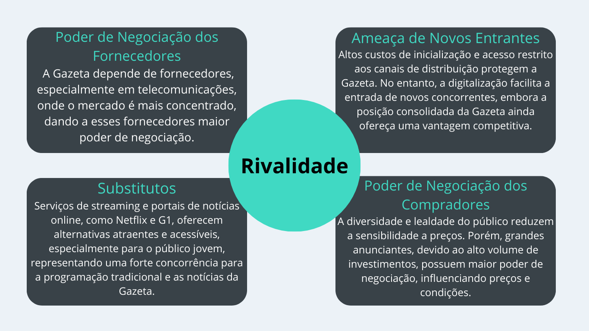 
Fonte: Material produzido pelos autores (2024)

**1 - Poder de negociação dos fornecedores**

&nbsp;&nbsp;&nbsp;&nbsp;A análise do poder de negociação dos fornecedores é essencial para entender como eles podem influenciar as operações da Rede Gazeta. A empresa depende de diversos fatores para realizar suas atividades diárias, como fornecedores de tecnologia, câmeras, estúdios, equipamentos de transmissão, servidores e softwares de edição. Embora existam muitas opções no mercado para esses serviços, o que reduz o poder de barganha dos fornecedores, a escolha correta é crucial para garantir a qualidade dos serviços prestados pela Gazeta.

&nbsp;&nbsp;&nbsp;&nbsp;Outro aspecto importante são os fornecedores de telecomunicações, como provedores de internet, serviços de satélite e operadoras de telefonia, essenciais para a operação contínua. Como poucas grandes empresas dominam esses mercados, o poder de barganha dessas indústrias é significativo devido à dependência da Gazeta desses serviços.

&nbsp;&nbsp;&nbsp;&nbsp;Os fornecedores de publicidade também desempenham um papel vital no setor financeiro da Rede Gazeta. A abundância de agências de publicidade reduz o poder de barganha individual e amplia as opções de escolha da empresa, permitindo que ela selecione o fornecedor que oferece a maior fonte de renda.

&nbsp;&nbsp;&nbsp;&nbsp;O poder de barganha dos fornecedores da Rede Gazeta varia conforme a categoria. Em áreas como telecomunicações, os fornecedores possuem um grau significativo de poder, enquanto em outras, a diversidade de opções permite maior flexibilidade para a Gazeta. Para mitigar o impacto desse poder de barganha, a Rede Gazeta pode buscar diversificar suas fontes, investir em tecnologia própria e estabelecer relações de longo prazo com fornecedores estratégicos.

**2 - Poder de negociação de clientes**

&nbsp;&nbsp;&nbsp;&nbsp;O poder de barganha dos clientes reflete sua capacidade de influenciar preços e condições de venda dos produtos ou serviços oferecidos pela Rede Gazeta. Esse poder é influenciado pela quantidade de alternativas disponíveis, a importância do produto para o cliente e o volume de compras realizado.

&nbsp;&nbsp;&nbsp;&nbsp;A rede Gazeta possui dois tipos de clientes, o público que consume os conteúdos da Gazeta, telespectadores que acompanham as produções, e os anunciantes, empresas que buscam anunciar seus produtos e serviços nas unidades de négocio da indústria.

&nbsp;&nbsp;&nbsp;&nbsp;A Gazeta possui uma base de público diversificada, com diferentes idades, grupos demográficos e interesses, o que pode diminuir o poder de barganha dessa audiência. No entanto, a lealdade do público é crucial, pois clientes fiéis tendem a ser menos sensíveis a preços.

&nbsp;&nbsp;&nbsp;&nbsp;O principal meio de manter a lealdade é a criação de conteúdo personalizado e de alta qualidade,oferecer programas de assinaturas exclusivos com descontos maiores para maiores durações e criar eventos específicos para o público, assim aumentando a fidelidade e a busca da audiência.

&nbsp;&nbsp;&nbsp;&nbsp;Os meios que a Gazeta poderia utilizar para amplificar a precisão dos conteúdos personalizados são integração com IA e Machine Learning e experimentar diferentes versões de conteúdo, para ter dados de qual é mais agradável ao público.

&nbsp;&nbsp;&nbsp;&nbsp;Os anunciantes, por sua vez, constituem uma parte significativa da receita. Grandes anunciantes possuem maior poder de barganha devido ao volume de investimentos em publicidade, o que lhes permite negociar preços e condições mais favoráveis.

&nbsp;&nbsp;&nbsp;&nbsp;Em resumo, o poder de barganha dos clientes na Rede Gazeta é influenciado pela diversidade e lealdade do público, que reduz a sensibilidade a preços. Entretanto, grandes anunciantes exercem um maior poder de negociação devido aos seus elevados investimentos, exigindo que a Gazeta gerencie cuidadosamente as expectativas para manter sua rentabilidade e competitividade.

**3 - Ameaças de novos entrantes**

&nbsp;&nbsp;&nbsp;&nbsp;A ameaça de novos entrantes depende das barreiras de entrada que dificultam a entrada de novas empresas no mercado. Para a Rede Gazeta, essas barreiras são fundamentais para manter sua competitividade e sustentabilidade.

&nbsp;&nbsp;&nbsp;&nbsp;Uma das principais barreiras são os altos custos de inicialização, que dificultam a entrada de novos concorrentes e protegem empresas consolidadas como a Gazeta. O acesso aos canais de distribuição, como redes de TV, rádio, jornais e plataformas digitais, também é crucial, e empresas mais antigas possuem relações consolidadas com distribuidores, criando uma barreira adicional.

&nbsp;&nbsp;&nbsp;&nbsp;Outra barreira de inicialização é a competição de marcas já consolidadas e valorizadas, que já possuem lealdade de seus telespectadores aos longos de vários anos, criando uma audiência engajada de estável, oferecendo uma grande vantagem competitiva para a Gazeta.

&nbsp;&nbsp;&nbsp;&nbsp;No entanto, a digitalização e o crescimento de plataformas online, como blogs e canais no YouTube, reduzem algumas dessas barreiras, permitindo a entrada de novos competidores.

&nbsp;&nbsp;&nbsp;&nbsp;Concluindo, a ameaça de novos entrantes no setor de mídia da Rede Gazeta é mitigada por altos custos de inicialização e acesso restrito aos canais de distribuição, o que favorece empresas estabelecidas. Ainda assim, a digitalização oferece oportunidades para novos concorrentes, embora a posição consolidada da Gazeta continue a proporcionar uma vantagem competitiva significativa.

**4 - Substitutos**

&nbsp;&nbsp;&nbsp;&nbsp;A ameaça de produtos substitutos refere-se ao potencial de produtos ou serviços alternativos atraírem os clientes da Rede Gazeta. Isso é influenciado pela disponibilidade, qualidade e custo dos substitutos, além da facilidade com que os clientes podem migrar para esses produtos.

&nbsp;&nbsp;&nbsp;&nbsp;Serviços como Netflix, Amazon Prime Video, Disney+ e YouTube oferecem uma ampla variedade de conteúdo, representando alternativas convenientes e acessíveis à programação tradicional de TV, especialmente para o público mais jovem.

&nbsp;&nbsp;&nbsp;&nbsp;Portais de notícias online como G1, UOL, Terra e veículos internacionais oferecem notícias em tempo real e gratuitamente, competindo fortemente com jornais e programas de notícias tradicionais.

&nbsp;&nbsp;&nbsp;&nbsp;A facilidade de acesso e o baixo custo dos substitutos digitais tornam a migração para essas alternativas atraente para os consumidores, especialmente quando o conteúdo é de alta qualidade ou exclusivo.

&nbsp;&nbsp;&nbsp;&nbsp;Para enfrentar essas ameaças a Gazeta tem investido na expansão para plataformas digitais, em sites, aplicativos e redes sociais, o que mantém a relevância para o público que migram pra essas plataformas e capturam novos públicos. Além disso, a Gazeta pode buscar parcerias com plataformas de streamings ara disponibilizar seus conteúdos nessas plataformas, e também trazer influenciadores locais para criar conteúdos em parceria para atrair novos públicos.

&nbsp;&nbsp;&nbsp;&nbsp;Assim, a ameaça de substitutos para a Rede Gazeta é significativa devido aos serviços de streaming e portais de notícias online, que oferecem conteúdo diversificado e frequentemente gratuito. Esses substitutos, atraentes para o público jovem, representam uma forte concorrência para a programação tradicional e a plataforma de notícias da Rede Gazeta.

**5 - Rivalidade entre os concorrentes existentes**

&nbsp;&nbsp;&nbsp;&nbsp;A rivalidade entre concorrentes existentes avalia a intensidade da competição no setor em que a Rede Gazeta atua. Essa rivalidade é influenciada por fatores como o número de competidores, taxa de crescimento do setor, custos fixos e variáveis, diferenciação de produtos e serviços, e as estratégias competitivas adotadas.

&nbsp;&nbsp;&nbsp;&nbsp;A Rede Gazeta enfrenta concorrência direta significativa no mercado de televisão local, como TV Vitória (RecordTV Espírito Santo), TV Tribuna (SBT Espírito Santo) e TV Capixaba (Band Espírito Santo)[[24]](#6-referências). No segmento de jornal impresso e digital, o Jornal A Tribuna e o portal Folha Vitória são os principais concorrentes. Além disso, portais de notícias nacionais e internacionais, plataformas de streaming e redes sociais competem pelo tempo de entretenimento do público.

&nbsp;&nbsp;&nbsp;&nbsp;O setor de mídia tradicionais	, como televisão e rádio, enfrenta um crescimento estagnado ou decrescente devido à migração para plataformas digitais, intensificando a rivalidade entre os concorrentes para capturar uma fatia maior de um mercado em declínio. Em contrapartida, o crescimento do consumo de conteúdo digital incentiva a entrada de novos concorrentes, aumentando ainda mais a competição.

&nbsp;&nbsp;&nbsp;&nbsp;Os elevados custos fixos com infraestrutura, tecnologia e pessoal obrigam as empresas a maximizar sua capacidade, intensificando a competição por audiência e receita publicitária.

&nbsp;&nbsp;&nbsp;&nbsp;Em suma, a Rede Gazeta opera em um ambiente altamente competitivo, enfrentando tanto concorrentes diretos no mercado local quanto concorrentes indiretos nas plataformas digitais. A estagnação do setor tradicional e o aumento do consumo de conteúdo digital intensificam essa rivalidade, exigindo estratégias eficazes para manter e expandir sua audiência e receita.

### Conclusão

&nbsp;&nbsp;&nbsp;&nbsp;A análise das cinco forças de Porter revela que a Rede Gazeta opera em um ambiente de mídia altamente competitivo e dinâmico. A empresa enfrenta desafios significativos em várias frentes, desde o poder de barganha dos fornecedores e clientes até a ameaça de novos entrantes e produtos substitutos, que são particularmente relevantes em um mercado cada vez mais digital. Além disso, a rivalidade entre os concorrentes existentes é intensa, exigindo da Gazeta estratégias inovadoras para manter sua relevância e competitividade.

&nbsp;&nbsp;&nbsp;&nbsp;Para continuar prosperando, a Rede Gazeta precisará não apenas gerenciar com eficácia suas relações com fornecedores e clientes, mas também inovar continuamente para se adaptar às mudanças tecnológicas e comportamentais. A diversificação de fontes de receita, o investimento em novas tecnologias e a exploração de novas plataformas digitais são caminhos promissores para enfrentar as ameaças e aproveitar as oportunidades identificadas. Assim, a Gazeta pode assegurar seu lugar em um mercado que, embora desafiador, ainda oferece grandes possibilidades de crescimento e desenvolvimento.

### 4.1.2. Análise SWOT

&nbsp;&nbsp;&nbsp;&nbsp;A matriz SWOT é uma ferramenta estratégica utilizada para identificar e analisar os pontos fortes (Strengths), fracos (Weaknesses), oportunidades (Opportunities) e ameaças (Threats) de uma empresa ou projeto. O objetivo desta análise é fornecer uma visão clara e abrangente das condições internas e externas que podem impactar o desempenho da organização, ajudando na formulação de estratégias eficazes para alcançar objetivos empresariais[[2]](#6-referências).

Figura 2 - Matriz Swot 
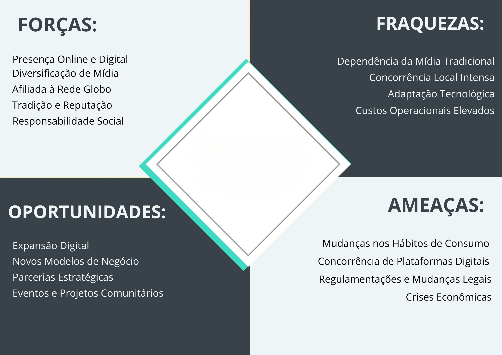 
Fonte: Material produzido pelos autores (2024)

#### Forças (Strengths)

1. **Tradição e Reputação**

   - Fundada em 1928, a Rede Gazeta é uma das instituições de mídia mais antigas e respeitadas do Espírito Santo, conhecida por seu jornalismo de qualidade e compromisso com a comunidade. A empresa tem uma longa história de prêmios e reconhecimentos, como o Prêmio Gazeta de Jornalismo, que celebra os talentos locais e fortalece a credibilidade da marca.

2. **Diversificação de Mídia**

   - A Rede Gazeta opera em televisão, rádio, jornal impresso e plataformas online, o que permite alcançar uma ampla audiência. Esta diversificação é evidente na operação de várias estações de rádio, incluindo a Gazeta AM e FM, e na presença online robusta com o portal Gazeta Online, que atrai milhões de visitantes mensais.

3. **Afiliada à Rede Globo**

   - A Rede Gazeta é afiliada à Rede Globo desde 1966, o que proporciona acesso a uma programação de alta qualidade e uma audiência consolidada. A parceria com a Globo permite à Rede Gazeta transmitir eventos de grande audiência, como a Copa do Mundo e as novelas de horário nobre, aumentando sua relevância no mercado local.

4. **Presença Online e Digital**

   - A empresa tem investido continuamente em sua presença digital, com a reformulação do portal Gazeta Online e o lançamento de aplicativos móveis. Em 2020, a Rede Gazeta lançou uma nova plataforma de streaming para conteúdo local, ampliando seu alcance digital e atraindo um público mais jovem.

5. **Responsabilidade Social**
   - A Rede Gazeta está envolvida em várias iniciativas de responsabilidade social, como o Projeto Estímulo, que apoia empreendedores locais, e o Prêmio Atitude Sustentável, que reconhece iniciativas ambientais. Estas ações reforçam seu compromisso com o desenvolvimento social e econômico do Espírito Santo.

#### Fraquezas (Weaknesses)

1. **Dependência da Mídia Tradicional**

   - Apesar dos investimentos em plataformas digitais, uma parte significativa da operação ainda depende da mídia tradicional. Em 2020, a receita publicitária da televisão e do jornal impresso representou mais de 60% do faturamento total, o que pode ser problemático à medida que a audiência migra para o digital.

2. **Concorrência Local Intensa**

   - A Rede Gazeta enfrenta forte concorrência de veículos locais, como A Tribuna e Folha Vitória, que também têm investido em plataformas digitais. Em 2019, A Tribuna lançou um novo portal de notícias com uma interface mais moderna, intensificando a competição por audiência online.

3. **Adaptação Tecnológica**

   - A rápida evolução tecnológica exige constantes adaptações. Em 2018, a Rede Gazeta teve que investir em uma atualização completa de seu sistema de gerenciamento de conteúdo para acompanhar as novas demandas do mercado digital, um processo que envolveu custos elevados e desafios operacionais.

4. **Custos Operacionais Elevados**
   - Manter operações diversificadas em múltiplas plataformas implica em altos custos operacionais. A manutenção de estúdios de televisão, redações de jornal e estações de rádio requer investimentos contínuos em infraestrutura e tecnologia, além de uma grande equipe de profissionais.

#### Oportunidades (Opportunities)

1. **Expansão Digital**

   - A crescente adoção de plataformas digitais oferece uma oportunidade significativa. Em 2021, a Rede Gazeta lançou um serviço de assinatura digital, o Gazeta Prime, oferecendo conteúdos exclusivos e sem publicidade, o que pode aumentar a receita e atrair novos assinantes.

2. **Novos Modelos de Negócio**

   - A empresa pode explorar novos modelos de receita, como conteúdos pagos e serviços de streaming. Em 2020, a Rede Gazeta iniciou parcerias com empresas de e-commerce para integrar ofertas de produtos em seu portal de notícias, criando uma nova fonte de receita.

3. **Parcerias Estratégicas**

   - Estabelecer parcerias com empresas de tecnologia pode fortalecer sua presença digital. A colaboração com a Google News Initiative em 2019 ajudou a Rede Gazeta a melhorar suas práticas de SEO e aumentar o tráfego online, mostrando o potencial das alianças estratégicas.

4. **Eventos e Projetos Comunitários**
   - Expandir o envolvimento em eventos locais e projetos comunitários pode reforçar a relação com a audiência. Em 2022, a Rede Gazeta planeja ampliar o Festival de Verão, um evento anual que atrai milhares de participantes e fortalece a conexão com a comunidade local.

#### Ameaças (Threats)

1. **Mudanças nos Hábitos de Consumo**

   - A migração crescente do público para plataformas digitais e serviços de streaming pode reduzir a audiência dos meios tradicionais. Entre 2015 e 2020, a audiência de TV aberta no Brasil caiu cerca de 20%, refletindo uma tendência que afeta diretamente a Rede Gazeta.Essa queda foi agravada pela popularidade crescente de plataformas como Netflix e YouTube, que oferecem conteúdo sob demanda e têm atraído especialmente as gerações mais jovens.

2. **Concorrência de Plataformas Digitais**

   - Grandes plataformas digitais, como Google e Facebook, atraem uma parte significativa da publicidade online. Em 2019, essas plataformas capturaram mais de 70% da receita publicitária digital no Brasil. Esse domínio se intensificou com o advento de tecnologias de segmentação de público, que permitiram a essas plataformas oferecerem uma publicidade mais direcionada e eficaz, tornando-as mais atrativas para os anunciantes em comparação com os meios tradicionais.

3. **Crises Econômicas**

   - Crises econômicas podem levar à redução dos investimentos em publicidade, afetando diretamente a receita das empresas de mídia. A recessão econômica de 2015-2016 no Brasil resultou em uma queda significativa nas receitas publicitárias da Rede Gazeta, que viu uma diminuição de aproximadamente 25% em suas receitas naquele período. Além disso, a crise econômica global de 2020, desencadeada pela pandemia de COVID-19, agravou ainda mais essa situação, com cortes drásticos nos orçamentos de publicidade em diversos setores.

4. **Regulamentações e Mudanças Legais**
   - Alterações nas regulamentações de mídia e leis governamentais podem criar novos desafios para as empresas do setor. Em 2018, a implementação do GDPR (Regulamento Geral sobre a Proteção de Dados) na União Europeia teve repercussões globais, forçando a Rede Gazeta a revisar suas políticas de privacidade e investir em conformidade, gerando custos adicionais. Além disso, discussões sobre a regulamentação das plataformas digitais no Brasil, como a Lei Geral de Proteção de Dados (LGPD), têm potencial para introduzir novas exigências e restrições que podem impactar a forma como a Rede Gazeta opera.

&nbsp;&nbsp;&nbsp;&nbsp;A análise SWOT da Rede Gazeta revela uma empresa com uma sólida base histórica e uma diversificação significativa em suas operações de mídia. Suas principais forças residem na tradição, reputação, e parcerias estratégicas, especialmente sua afiliação com a Rede Globo. No entanto, a empresa enfrenta desafios consideráveis, incluindo a dependência de mídias tradicionais, a necessidade de adaptação tecnológica constante, e a intensa concorrência local e digital.

&nbsp;&nbsp;&nbsp;&nbsp;As oportunidades para a Rede Gazeta são promissoras, com potencial de expansão digital e desenvolvimento de novos modelos de negócio que podem compensar as fraquezas atuais. No entanto, é crucial que a empresa esteja atenta às ameaças representadas pelas mudanças nos hábitos de consumo de mídia, a concorrência de grandes plataformas digitais, e os impactos de crises econômicas e regulamentações legais.

&nbsp;&nbsp;&nbsp;&nbsp;Ao compreender essas dinâmicas, a Rede Gazeta pode elaborar estratégias eficazes para fortalecer suas operações, inovar em suas ofertas e continuar a servir a comunidade capixaba com qualidade e compromisso.

###  4.1.3. Planejamento Geral da Solução

#### Dados Disponíveis
&nbsp;&nbsp;&nbsp;&nbsp;A equipe tem acesso a duas das principais fontes de dados fornecidas pela Rede Gazeta:

1. **Tabela de Audiência**:
   - **Conteúdo**: Informações sobre a audiência dos canais da Rede Gazeta (TV, internet, rádio) organizadas por período.
   - **Campos Principais**: Período, audiência por canal.

2. **Tabela de Projetos Realizados**:
   - **Conteúdo**: Dados sobre os projetos realizados para empresas parceiras, incluindo detalhes financeiros e de clientes.
   - **Campos Principais**: Clientes, origem da compra, segmento, data do projeto, valor do projeto, desconto aplicado.

#### Solução Proposta
&nbsp;&nbsp;&nbsp;&nbsp;A solução proposta consiste em desenvolver um modelo preditivo capaz de calcular receitas futuras para os canais da Rede Gazeta. O modelo se baseará nos dados de audiência e nos projetos realizados, utilizando técnicas de regressão para gerar previsões precisas e automáticas. Essa solução visa otimizar a previsão de receitas, oferecendo maior agilidade e precisão em comparação com métodos manuais.

#### Tipo de Tarefa
&nbsp;&nbsp;&nbsp;&nbsp;A tarefa principal deste projeto é uma **regressão**, dado que o objetivo é prever valores contínuos (receitas futuras), levando em consideração variáveis como descontos e valores líquidos de projetos.

#### Utilização da Solução Proposta
&nbsp;&nbsp;&nbsp;&nbsp;O modelo preditivo será utilizado para automatizar a tarefa de previsão de receitas, tornando o processo mais rápido e eficiente. A ferramenta permitirá à Rede Gazeta realizar previsões com maior granularidade e precisão, suportando decisões estratégicas em relação à alocação de recursos e planejamento financeiro. O sistema será uma ferramenta a mais no processo de análise de receita da gazeta, sendo utilizado pelos gestores e analistas financeiros no ato de realizar a previsão de receita da empresa e permitindo a filtragem dos dados que desejam considerar nesse processo, a fim de que a previsão seja direcionada para o setor, segmento, veículo ou unidade de negócio que for desejado. Assim, a implementação do modelo se dará de forma a complementar as ferramentas de análise de receita já utilizadas pela Rede Gazeta.

#### Benefícios da Solução Proposta
- **Agilidade**: Redução do tempo necessário para calcular previsões de receitas.
- **Precisão**: Melhorias na exatidão das previsões, suportadas por dados históricos e técnicas de regressão.
- **Granularidade**: Capacidade de realizar previsões detalhadas, considerando múltiplas variáveis e fontes de dados.

#### Critério de Sucesso
&nbsp;&nbsp;&nbsp;&nbsp;O sucesso do projeto será avaliado com base na assertividade do modelo preditivo, com uma meta de superar 60% de precisão nas previsões de receitas. A métrica principal utilizada será o erro médio absoluto (MAE), complementada pelo erro percentual absoluto médio (MAPE) para avaliar a precisão em termos percentuais. Essas métricas serão monitoradas regularmente, e, conforme a performance do modelo for analisada ao longo do tempo, ajustes poderão ser feitos para incorporar novos dados ou adaptar o modelo às mudanças de mercado, garantindo que as previsões continuem alinhadas às necessidades e estratégias da Rede Gazeta.

###  4.1.4. Value Proposition Canvas

&nbsp;&nbsp;&nbsp;&nbsp;O canvas de proposta de valor detalha as dores e ganhos do projeto, focando em incluir a realidade do parceiro e oferecer uma solução que corresponda às expectativas da _Rede Gazeta_. Essa abordagem envolve uma análise das necessidades específicas e desafios enfrentados pelo parceiro, garantindo que a solução proposta seja adequada, eficaz e individualizada[[7]](#6-referências).

Figura 3 - Canva de Proposta de Valor 
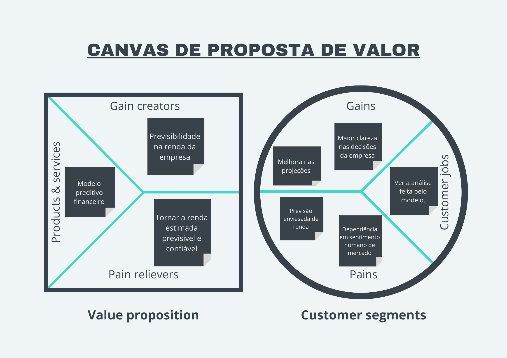 
Fonte: Material produzido pelos autores (2024)

#### Proposta de valor

1. **Criadores de ganho**

   - **Previsibilidade na renda da empresa**: Com um modelo preditivo financeiro, a empresa pode prever a renda com base em dados históricos, proporcionando maior clareza e confiança nas projeções.

2. **Aliviadores de dor**

   - **Tornar a renda estimada previsível e confiável**: Utilizando um modelo preditivo, as estimativas de renda se tornam mais precisas e confiáveis, reduzindo a incerteza e o viés humano nas previsões.

#### Segmentos de clientes

1. **Gains (Ganhos)**

   - **Maior clareza nas decisões da empresa**: Com previsões financeiras mais precisas, a empresa pode tomar decisões melhores e estratégicas.

   - **Melhora nas projeções**: A precisão nas previsões financeiras resulta em projeções mais realistas e úteis para o planejamento da empresa.

2. **Pains (Dores)**

   - **Previsão enviesada de renda**: A falta de previsibilidade pode levar a decisões baseadas em suposições incorretas.

   - **Dependência em sentimento humano de mercado**: As previsões baseadas em intuições humanas podem ser falhas e influenciadas por emoções ou informações incompletas.

#### Tarefas dos clientes

1. **Ver a análise feita pelo modelo**: Clientes desejam entender e verificar as análises financeiras geradas pelo modelo preditivo para confiar nas decisões baseadas nesses dados.

&nbsp;&nbsp;&nbsp;&nbsp;Essa proposta de valor enfatiza como um modelo preditivo financeiro pode trazer previsibilidade e confiança para a renda da empresa, aliviando dores associadas a previsões imprecisas e enviesadas, e oferecendo ganhos como clareza nas decisões e melhores projeções.

### 4.1.5. Matrizes

#### 4.1.5.1 Matriz de riscos

&nbsp;&nbsp;&nbsp;&nbsp;A Matriz de Riscos é uma ferramenta muito útil para a análise e avaliação dos potenciais riscos em um projeto. Ela é utilizada para classificar e organizar os riscos em uma matriz que considera tanto a probabilidade de ocorrência quanto o impacto caso venham a se concretizar, apresentados de forma crescente. Essa abordagem permite identificar os riscos que merecem maior atenção e prioridade, baseando-se no cruzamento entre probabilidade e impacto. Assim, a Matriz de Riscos possibilita uma gestão de projeto mais eficaz e proativa para um projeto bem sucedido[[16]](#6-referências).

Figura 4 - Matriz de Riscos 
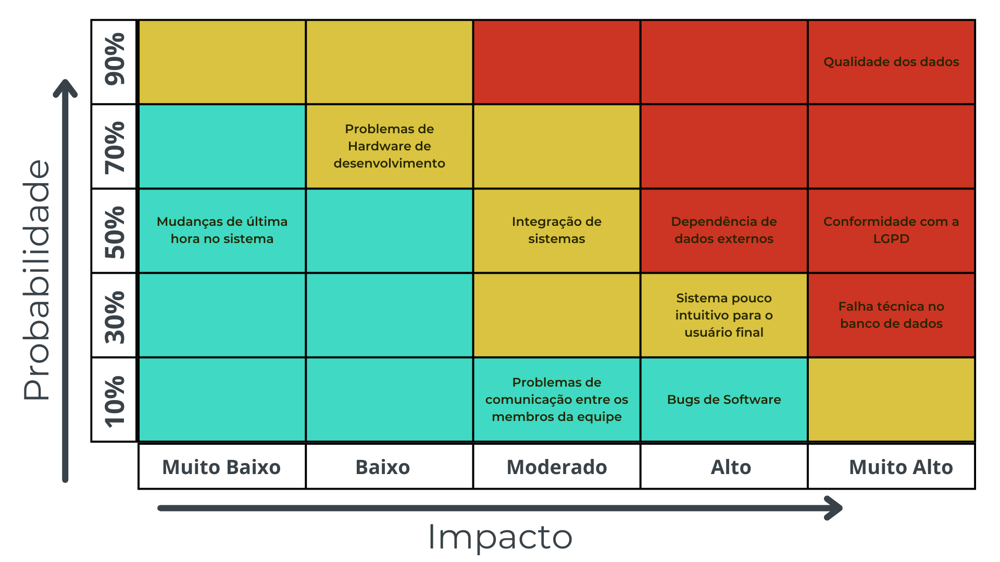 
Fonte: Material produzido pelos autores (2024)

### Prioridades

#### Baixa Prioridade

1. **Problemas de Comunicação entre os Membros da Equipe**

   - **Descrição**: Falta de comunicação eficaz entre os membros da equipe de desenvolvimento.
   - **Impacto**: O impacto desse problema está relacionado aos possíveis mal-entendidos, retrabalho e atrasos no projeto.
   - **Plano de Resposta ao Risco**: **Mitigar** - Reduzir a probabilidade e/ou impacto do problema ao implementar ferramentas de comunicação eficazes e promover reuniões regulares de alinhamento.

2. **Mudanças de Última Hora no Sistema**

   - **Descrição**: Pequenas mudanças nos requisitos do projeto no último minuto.
   - **Impacto**: O impacto desse problema seria na produção da aplicação, gerando um projeto conflituoso e talvez até apressado, podendo até mesmo afetar a entrega final da aplicação.
   - **Plano de Resposta ao Risco**: **Evitar** - Manter a comunicação clara e limpa para evitar que mudanças de última hoja ocorram.

#### Média Prioridade

1. **Bugs de Software**

   - **Descrição**: Falhas ou bugs no Software.
   - **Impacto**: Esse risco é referente aos conflitos internos da aplicação, que poderiam interferir na utilização do projeto, atrapalhando a experiência do usuário.
   - **Plano de Resposta ao Risco**: **Mitigar** - Implementar processos de teste contínuo e automação para detectar e corrigir bugs antes que impactem o usuário final.

2. **Sistema Pouco Intuitivo para o Usuário Final**

   - **Descrição**: Interface ou funcionalidades que não são fáceis de usar para o usuário final.
   - **Impacto**: Pode resultar em baixa adoção e satisfação dos usuários, impactando em uma possível baixa usabilidade do sistema.
   - **Plano de Resposta ao Risco**: **Mitigar** - Conduzir testes de usabilidade e melhorar o design com base no feedback dos usuários para garantir uma experiência mais intuitiva.

3. **Problemas de Hardware de Desenvolvimento**

   - **Descrição**: Falhas em equipamentos de hardware usados no desenvolvimento.
   - **Impacto**: O impacto desse risco seria na hora do desenvolvimento da aplicação, podendo interferir no processo interno - talvez até resultando em atrasos.
   - **Plano de Resposta ao Risco**: **Evitar** - Manter os aparelhos de produção sempre atualizados conforme as normas do desenvolvedor, assim como zelo pelos dispositivos para evitar maiores dificuldades de velocidade e processamento.

4. **Integração de Sistemas**

   - **Descrição**: Problemas na integração do modelo preditivo com os sistemas existentes.
   - **Impacto**: O impacto desse problema seria na funcionalidade e eficiência da aplicação.
   - **Plano de Resposta ao Risco**: **Mitigar** - Realizar testes de integração antecipadamente e manter uma comunicação constante com os fornecedores de sistemas para evitar incompatibilidades.

#### Alta Prioridade

1. **Qualidade dos Dados**

   - **Descrição**: Dados incompletos, inconsistentes ou desatualizados podem afetar a precisão do modelo.
   - **Impacto**: O impacto desse problema seria na precisão do modelo preditivo, nas metas de receita e pode afetar a qualidade dos resultados previstos.
   - **Plano de Resposta ao Risco**: **Mitigar** - Aplicar processos de validação, limpeza e tratamento de dados para garantir a qualidade e consistência antes de serem utilizados pelo modelo preditivo.

2. **Dependência de Dados Externos**

   - **Descrição**: Dados externos podem não ser atualizados ou podem se tornar inacessíveis.
   - **Impacto**: Esse risco pode afetar a precisão do modelo preditivo e as metas de receita, comprometendo a confiabilidade das previsões e a tomada de decisões baseadas nelas.
   - **Plano de Resposta ao Risco**: **Mitigar** - Estabelecer acordos com fornecedores de dados para diversificar as fontes e reduzir a dependência de um único fornecedor, evitando processos enviesados e falhos.

3. **Conformidade com a LGPD**

   - **Descrição**: Uso inadequado de dados pessoais pode levar a violações da Lei Geral de Proteção de Dados (LGPD).
   - **Impacto**: Esse risco envolve questões legais e financeiras, além de prejudicar a reputação da empresa, resultando em possíveis perdas de confiança dos clientes.
   - **Plano de Resposta ao Risco**: **Evitar** - Implementar políticas rigorosas de conformidade com a LGPD e realizar auditorias regulares para garantir que todos os processos estejam em conformidade.

4. **Falha Técnica no Banco de Dados**

   - **Descrição**: Problemas de desempenho ou falhas no banco de dados que suportam a aplicação.
   - **Impacto**: Pode levar à perda de dados, downtime e comprometimento da integridade dos dados.
   - **Plano de Resposta ao Risco**: **Mitigar** - Implementar redundância e backups regulares para garantir a continuidade do serviço e minimizar a perda de dados em caso de falhas.

&nbsp;&nbsp;&nbsp;&nbsp;Em conclusão, a Matriz de Riscos facilita a análise mais completa das possíveis vulnerabilidades que podem impactar o desenvolvimento do projeto. Ao classificar os riscos com base no impacto e na probabilidade de ocorrência, é possível estabelecer uma ordem de prioridade das ameaças. Assim, fica mais simplificado adotar medidas preventivas para evitar erros, reduzir riscos e assegurar a eficácia do projeto.

#### 4.1.5.2 Matriz de Oportunidades

&nbsp;&nbsp;&nbsp;&nbsp;A Matriz de Oportunidades é uma ferramenta importante para a identificação e avaliação das potenciais oportunidades no desenvolvimento de um projeto. Ela é utilizada para classificar e organizar essas oportunidades de uma maneira que considera tanto a probabilidade de ocorrência quanto o impacto positivo - caso venham a se concretizar - apresentados de forma crescente. Isso permite identificar as oportunidades que merecem maior foco e investimento, baseado no cruzamento entre probabilidade e impacto. Assim, a Matriz de Oportunidades possibilita uma gestão de projeto mais estratégica e voltada para o crescimento, garantindo o melhor aproveitamento das oportunidades para um projeto.

Figura 5 - Matriz de Oportunidades 
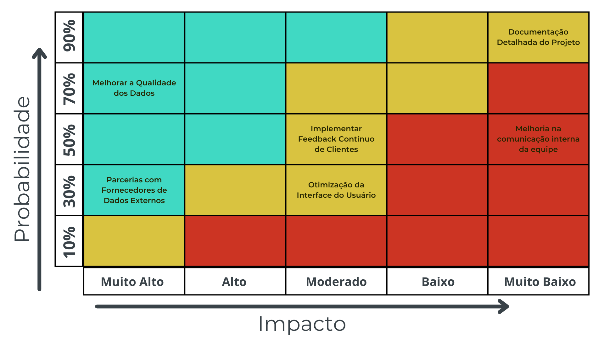 
Fonte: Material produzido pelos autores (2024)

### Oportunidades

#### Baixa Prioridade

1. **Melhoria na Comunicação Interna da Equipe**

   - **Descrição**: Implementação de ferramentas e práticas para melhorar a comunicação entre os membros da equipe.
   - **Impacto**: Pode reduzir mal-entendidos e aumentar a eficiência do trabalho em equipe.
   - **Plano de Resposta à Oportunidade**: Aceitar: Estar disposto a aproveitar os impactos positivos, caso a oportunidade ocorra.

#### Média Prioridade

1. **Implementar Feedback Contínuo de Clientes**

   - **Descrição**: Criar um sistema de feedback contínuo para melhorar os serviços com base nas opiniões dos clientes.
   - **Impacto**: Melhora continuamente os produtos e serviços, aumentando a satisfação e retenção dos clientes.
   - **Plano de Resposta à Oportunidade**: Aumentar: Aumentar a probabilidade e/ou impactos da oportunidade.

2. **Otimização da Interface do Usuário**

   - **Descrição**: Melhorar a usabilidade e a experiência do usuário no sistema.
   - **Impacto**: Aumenta a satisfação do usuário e a adoção do sistema.
   - **Plano de Resposta à Oportunidade**: Explorar: Garantir que a oportunidade ocorra para aproveitar os impactos positivos.

#### Alta Prioridade

1. **Melhorar a Qualidade dos Dados**

   - **Descrição**: Desenvolver um sistema para garantir a consistência e atualização dos dados.
   - **Impacto**: Garante a precisão dos dados, melhorando a eficácia do modelo preditivo.
   - **Plano de Resposta à Oportunidade**: Aumentar: Aumentar a probabilidade e/ou impactos da oportunidade.

2. **Parcerias com Fornecedores de Dados Externos**

   - **Descrição**: Estabelecer parcerias com fornecedores confiáveis de dados externos.
   - **Impacto**: Garante acesso contínuo a dados de alta qualidade e pode melhorar as previsões.
   - **Plano de Resposta à Oportunidade**: Compartilhar: Compartilhar a oportunidade com terceiros que possam capturar melhor os benefícios dela.

3. **Documentação Detalhada do Projeto**

   - **Descrição**: Criar uma documentação abrangente para todos os aspectos do projeto.
   - **Impacto**: Facilita a manutenção e a transferência de conhecimento entre os membros da equipe.
   - **Plano de Resposta à Oportunidade**: Aceitar: Estar disposto a aproveitar os impactos positivos, caso a oportunidade ocorra.

&nbsp;&nbsp;&nbsp;&nbsp;Para concluir, a Matriz de Oportunidades permite uma análise mais abrangente das potencialidades que podem impulsionar o sucesso de um projeto. Ao classificar as oportunidades com base no impacto positivo e na probabilidade de ocorrência, pode-se priorizar as ações que gerem maior valor para o produto final. Assim, fica mais simples implementar técnicas para um maior aproveitamento dessas oportunidades e garantir que o projeto alcance o melhor resultado.

## 4.1.6. Personas

&nbsp;&nbsp;&nbsp;&nbsp; Com o propósito de proporcionar uma experiência mais realista para os funcionários da Rede Gazeta que analisam e preveem a receita da empresa, utilizamos a técnica de criação de personas, que são personagens fictícios que representam o cliente ideal de um negócio[[21]](#6-referências). Criamos representações fictícias de usuários, baseadas em dados coletados sobre suas motivações, objetivos, desafios e preocupações. Essas personas ajudam nossa equipe a manter o foco nos usuários durante todo o processo de desenvolvimento, garantindo que as funcionalidades do projeto sejam mais eficientes.

&nbsp;&nbsp;&nbsp;&nbsp;    Esses personagens foram confeccionados com base nas informações coletadas em todos os contatos com os profissionais da empresa. Foram feitas perguntas estratégicas para compreendermos o contexto em que os gestores estão inseridos. Dito isso, seguem as personas criadas:

Figura 6 - Persona Rodrigo Silva 
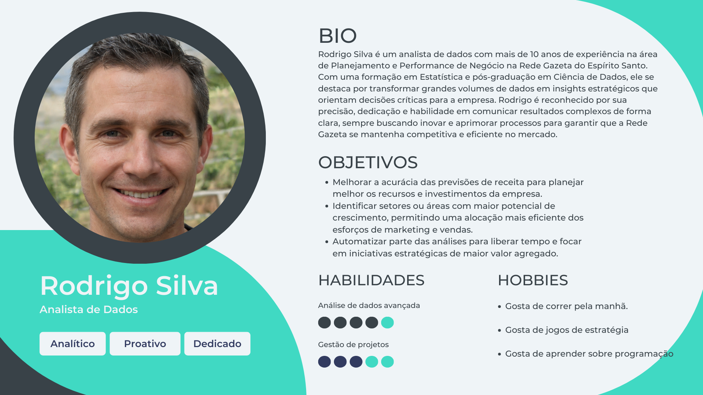 
Fonte: Material produzido pelos autores (2024)

&nbsp;&nbsp;&nbsp;&nbsp;Rodrigo Silva é analista de dados e gosta de tomar decisões de negócios baseadas em números. Ele é um estatístico e cientista de dados, e seu cargo na Rede Gazeta do Espírito Santo mostra sua capacidade de detectar padrões numéricos e transformar dados em informações úteis para a sua equipe. Rodrigo é uma pessoa meticulosa e analítica, sempre atento aos detalhes, buscando a maior precisão em suas análises para garantir que as decisões de negócios sejam fundamentadas em dados sólidos. No entanto, ao utilizar o modelo preditivo para auxiliar em suas tarefas, Rodrigo pode enfrentar dificuldades ao interpretar as previsões e integrá-las com suas análises existentes. Ele pode precisar ajustar seus métodos ou reavaliar dados para assegurar que as previsões sejam úteis e precisas. Rodrigo é um profissional curioso por novas tecnologias, o que o leva a explorar ferramentas que possam melhorar o desempenho da Rede Gazeta. Em seu tempo livre, Rodrigo acorda cedo para correr pela manhã, joga seu estilo preferido de jogo, estratégia, e sempre mantém seu conhecimento atualizado, aprimorando suas técnicas em programação.

Figura 7 - Persona Mario Rodrigues 
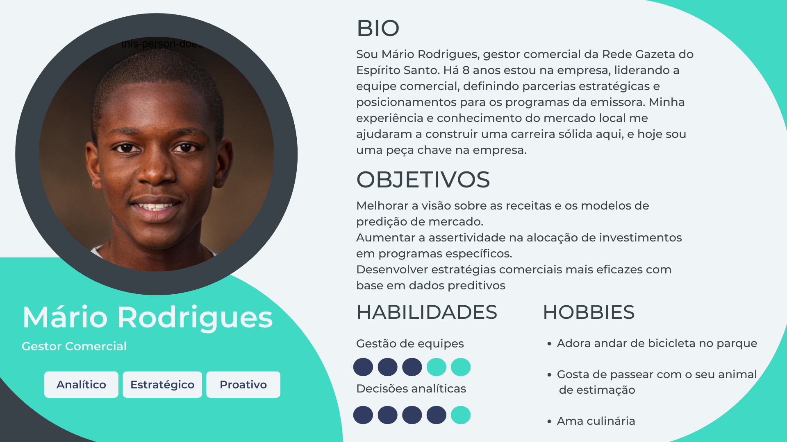 
Fonte: Material produzido pelos autores (2024)

&nbsp;&nbsp;&nbsp;&nbsp;Mário Rodrigues é um gestor comercial da Rede Gazeta, com 8 anos de experiência na empresa. Entre as suas principais competências, destacam-se sua sagaz gestão de equipes e suas decisões analíticas consistentes. Ele mistura suas características analíticas e estratégicas em seu cotidiano, sendo uma pessoa proativa. Mário utiliza o modelo preditivo para tomar decisões estratégicas, mas pode encontrar dificuldades ao interpretar as previsões de forma que se encaixem diretamente em suas necessidades diárias. A incerteza que pode surgir das previsões requer que Mário adapte suas estratégias rapidamente e comunique essas previsões de maneira clara e eficaz para sua equipe, garantindo que todos compreendam as implicações. Seus hobbies incluem andar de bicicleta no parque, passear com Billy, seu animal de estimação, e culinária, sendo fascinado por aprender e realizar novas receitas.

Figura 8 - Persona Sônia Araujo 
 
Fonte: Material produzido pelos autores (2024)

&nbsp;&nbsp;&nbsp;&nbsp;Sônia Araújo é uma economista experiente na análise de negócios. Suas incríveis habilidades a levaram a trabalhar na Rede Gazeta, onde ela se destaca na interpretação de modelos preditivos e análise de dados financeiros. Sônia é metódica e realiza suas tarefas diárias com um alto nível de detalhamento, sempre buscando aprender algo novo. Contudo, ao utilizar o modelo preditivo, Sônia pode enfrentar desafios ao justificar as previsões geradas para seus superiores. Ela precisa garantir que as previsões sejam compreendidas e aceitas pela liderança da empresa, o que exige que Sônia encontre maneiras de comunicar os resultados de forma clara e convincente. Fora do campo profissional, Sônia gosta de montar cubo mágico, ler livros variados, e assistir séries e filmes de suspense e ficção científica, sendo Interestelar o seu filme favorito.

&nbsp;&nbsp;&nbsp;&nbsp;Em síntese, a criação das personas é útil para garantir que o desenvolvimento do projeto esteja a par das reais necessidades dos usuários da Rede Gazeta. Essas representações fictícias, porém baseadas em pesquisas, garantem que todas as decisões sejam centradas no usuário, aumentando a eficácia e a precisão das soluções propostas. Dito isso, as personas orientam nossa equipe ao longo de todo o processo de desenvolvimento e também trilham um caminho para que os objetivos da empresa sejam alcançados de forma mais eficiente e direcionada.

#### 4.1.6.1. User Stories

&nbsp;&nbsp;&nbsp;&nbsp;As _User Stories_ são elementos fundamentais do desenvolvimento ágil para software, servindo como ponte entre as necessidades técnicas do projeto e as expectativas sobre ele. São descrições concisas sobre cenários de uso do projeto em questão, que pensam na utilização do serviço a partir do ponto de vista do usiário final. Cada User Story pensa em gerar valor e entendimento aos usuários finais por meio de uma tabela simples, detalhando o que precisa ser feito, como precisa ser feito e por quê deve ser feito[[3]](#6-referências).

Figura 9 - User Stories 01 
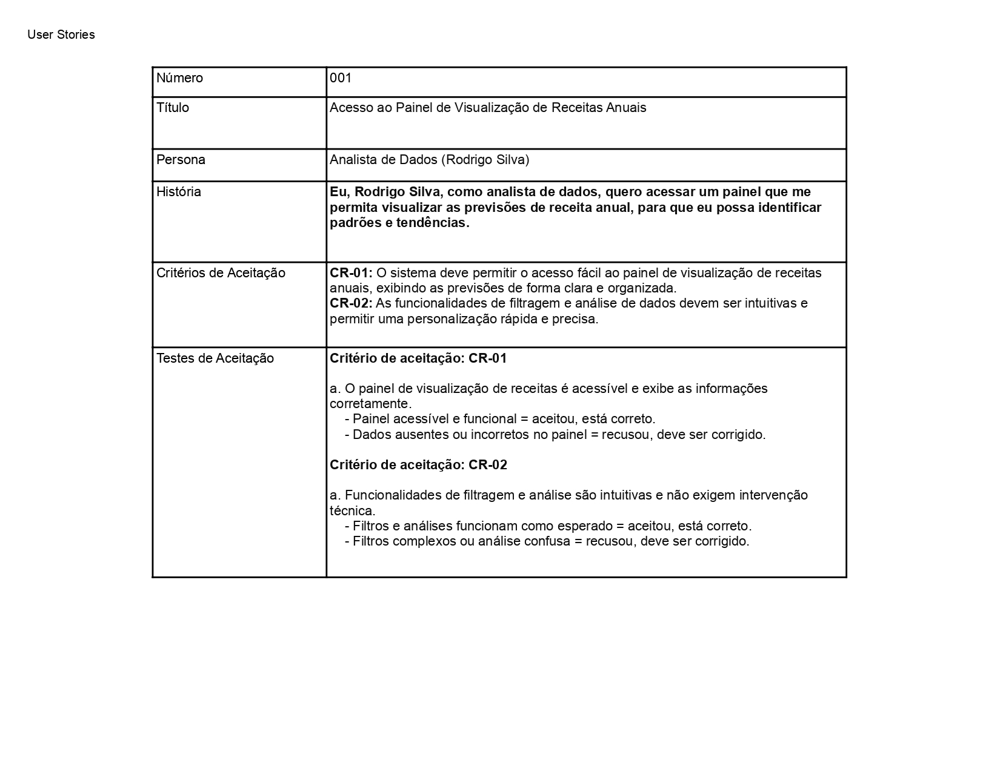 
Fonte: Material produzido pelos autores (2024)

Figura 10 - User Stories 02 
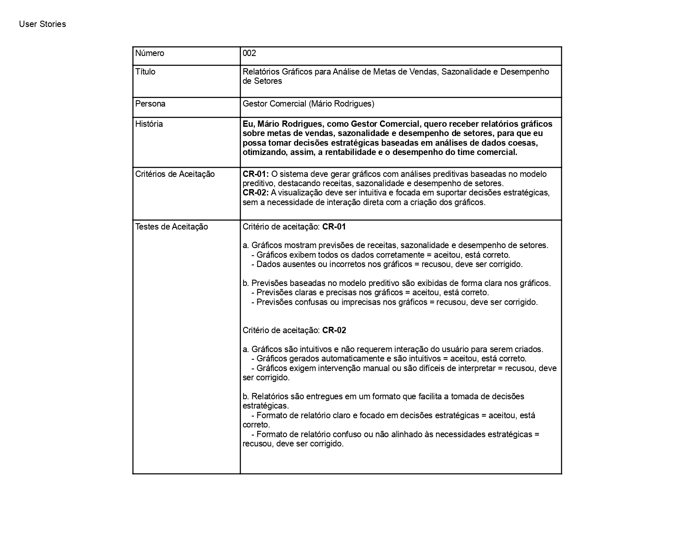 
Fonte: Material produzido pelos autores (2024)

Figura 11 - User Stories 03 
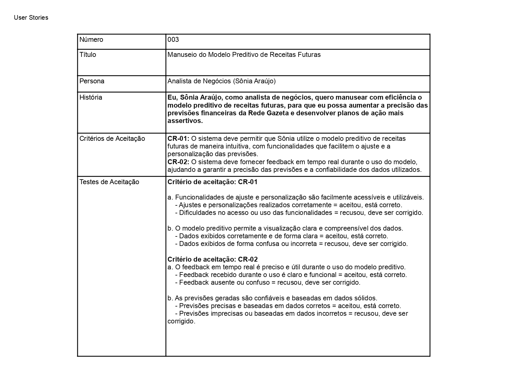 
Fonte: Material produzido pelos autores (2024)

&nbsp;&nbsp;&nbsp;&nbsp;Em conclusão, as _User Stories_ desempenham um papel importante em um projeto ao traduzir tarefas completas em ações simples e de fácil compreensão, alinhando os esforços de desenvolvimento com as expectativas dos usuários. Por meio da implementação, elas garantem o entendimento entre os usuários finais e as equipes de desenvolvimento e estabelecem um caminho para uma entrega de valor do produto.

## 4.1.7. Jornadas do Usuário

&nbsp;&nbsp;&nbsp;&nbsp;A Jornada do Usuário é uma ferramenta utilizada para mapear e entender as utilizações de um usuário em um sistema ao longo de várias etapas. Ela é utilizada para identificar e documentar as diferentes fases que o usuário passa, desde o primeiro contato até a finalização de suas atividades, mantendo uma ligação entre as suas necessidades, emoções e pontos de contato[[9]](#6-referências). Dessa forma, é possível fazer uma análise detalhada das experiências dos usuários, para identificar oportunidades de melhoria e priorizar diferentes funcionalidades. Assim, a Jornada do Usuário contribui para o desenvolvimento de um projeto de maneira centrada no usuário, garantindo uma experiência alinhada às expectativas e necessidades do cliente.

Figura 12 - Jornada de Usuário - Rodrigo Silva 
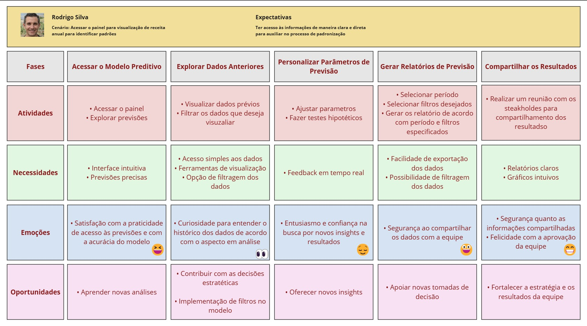 
Fonte: Material produzido pelos autores (2024)

&nbsp;&nbsp;&nbsp;&nbsp;A jornada do usuário de Rodrigo Silva, um analista de dados da Rede Gazeta, foi mapeada para entender as suas interações com o modelo preditivo de receitas anuais. A jornada foi dividida em cinco fases principais, desde o acesso ao modelo preditivo até o compartilhamento dos resultados com stakeholders. Cada fase foi pensada para capturar as atividades realizadas, as necessidades específicas do usuário, suas emoções ao longo do processo e as oportunidades de melhoria em cada etapa. Desse modo, é possível identificar que o usuário precisa de uma interface intuitiva, previsões precisas e ferramentas que facilitem a visualização, além do compartilhamento dos dados. Esse mapa reflete a importância de uma experiência do usuário fluida e eficiente, que suporte atividades analíticas e estratégicas, garantindo que seja possível contribuir com insights e decisões para a empresa.

Figura 13 - Jornada de Usuário - Mário Rodrigues 
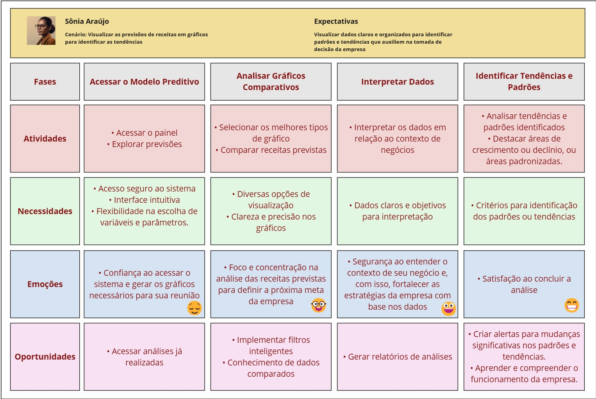 
Fonte: Material produzido pelos autores (2024)

&nbsp;&nbsp;&nbsp;&nbsp;A jornada do usuário de Mário Rodrigues, gestor comercial da Rede Gazeta, foi estruturada para compreender as suas interações com o modelo preditivo de previsão de receitas para otimizar o desempenho de sua equipe. Dividida em cinco fases, a jornada inicia com o acesso ao modelo e se abrange até a tomada de decisões estratégicas baseadas nos relatórios gerados. Durante cada etapa, foram identificadas as atividades que o usuário realiza, as necessidades que ele possui para executar cada uma, suas emoções ao longo do processo e as oportunidades de melhora. Essa jornada deixa clara a importância de uma interface intuitiva, dados confiáveis e relatórios acessíveis, para que o usuário possa tomar decisões eficientes que contribuam para melhorar o desempenho do time comercial e alcançar os objetivos estratégicos da empresa.

Figura 14 - Jornada de Usuário - Sônia Araújo 
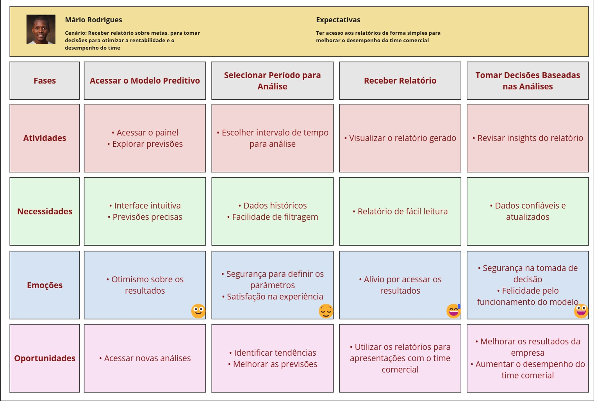 
Fonte: Material produzido pelos autores (2024)

&nbsp;&nbsp;&nbsp;&nbsp;A jornada do usuário de Sônia Araújo, analista de negócios da Rede Gazeta, foi desenvolvida para compreender as suas interações com o modelo preditivo para identificar padrões e tendências das receitas previstas. Dividida em quatro fases, a jornada começa com o acesso ao modelo e é finalizada na identificação de tais tendências. Durante cada fase, pontuamos a atividade que precisa ser realizada, as necessidades do usuário para realização da mesma, quais as emoções esperadas na etapa e, também, quais as oportunidades que aquela etapa proporciona. Esse mapeamento deixa claro a importância de um sistema seguro e bem organizado para visualização dos dados finais da previsão, para que o usuário possa tomar decisões eficientes com suas identificações finais, contribuindo para melhorar o desenvolvimento da empresa.

&nbsp;&nbsp;&nbsp;&nbsp;Em conclusão, a Jornada do Usuário oferece uma visão detalhada sobre as interações e necessidades dos usuários ao longo do processo de uso do modelo preditivo. Ao mapear etapas unitárias, desde o acesso inicial até a finalização das atividades, é possível identificar pontos de melhoria e de oportunidade que podem ser priorizados para aprimorar a experiência do usuário. Assim, o desenvolvimento do projeto se torna mais direcionado e eficiente, assegurando que as soluções implementadas estejam alinhadas com as expectativas e necessidades dos usuários, resultando em um projeto final que atende de forma específica os objetivos do negócio.

## 4.1.8 Política de Privacidade

Política de Privacidade da SapientIA - Inteli[[13]](#6-referências)

&nbsp;&nbsp;&nbsp;&nbsp;A política de privacidade possui o objetivo de esclarecer aos usuários as medidas e práticas implementadas para o tratamento e segurança dos dados.Também aborda os direitos e responsabilidades tanto dos clientes quanto da empresa em relação à informação coletada.

**Informações Gerais da empresa:**

  &nbsp;&nbsp;&nbsp;&nbsp;A Política de Privacidade da SapientIA, grupo de estudantes do Instituto de Tecnologia e Liderança, visa garantir a proteção e preservação dos dados financeiros disponibilizados pela Rede Gazeta e explicar os direitos dos titulares dos dados, assegurando que eles possam acessar, corrigir e eliminar suas informações conforme necessário. A SapientIA é uma empresa dedicada ao desenvolvimento de modelo preditivo avançado para previsões de receitas, e, para isso, adota práticas rigorosas de segurança e privacidade.

**Tratamento de Dados:**

  &nbsp;&nbsp;&nbsp;&nbsp;Esta seção tem como objetivo informar sobre o manuseio e manipulação dos dados, os quais serão tratados com medidas de segurança para preservar a confidencialidade dos dados sensíveis e evitar qualquer divulgação indevida. Destaca-se que esses dados serão utilizados exclusivamente para o desenvolvimento de modelos preditivos com o objetivo final de prever o número de vendas futuras da Rede Gazeta. A SapientIA compromete-se com o tratamento responsável dos dados, em total conformidade com a Lei Geral de Proteção de Dados (LGPD).

**Fonte de Coleta de Dados:**

&nbsp;&nbsp;&nbsp;&nbsp;Os dados são coletados exclusivamente por meio dos informes mensais e anuais compartilhados pela Rede Gazeta, fonte oficial e regulamentada de informações.

**Dados Pessoais e Dados Sensíveis:**

&nbsp;&nbsp;&nbsp;&nbsp;Na base de dados compartilhada, não são divulgados dados pessoais. Logo, os dados compartilhados compreendem informações sobre a própria receita, valores de contratos de publicidade, descontos aplicados, taxa de ocupação do inventário publicitário, dados de performance de vendas anteriores, informações sobre audiência dos veículos de mídia e outros dados financeiros da Rede Gazeta que são relevantes para o desenvolvimento do modelo. É importante destacar que todos os dados são tratados de forma anonimizada e agregada, assegurando a conformidade com os princípios de privacidade e proteção de dados.

**Finalidade do Tratamento de Dados:**

&nbsp;&nbsp;&nbsp;&nbsp;Os dados obtidos são utilizados para treinar e validar o modelo preditivo desenvolvido para análise das receitas da Rede Gazeta. O objetivo é identificar padrões e tendências para definir estratégias, de forma a maximizar os lucros da empresa com base em dados consolidados.

**Armazenamento dos Dados:**

&nbsp;&nbsp;&nbsp;&nbsp;Os dados são preservados em arquivos CSV e XLSX, com um controle rigoroso de acesso para a segurança do ambiente. A base do projeto é isolada de potenciais ameaças externas e garante a integridade dos dados. As práticas de segurança incluem criptografia de dados em repouso e durante a transferência, além de políticas de controle de acesso baseadas em autorização mínima.

**Período de Retenção dos Dados:**

&nbsp;&nbsp;&nbsp;&nbsp;Os dados são retidos por um período de 10 semanas, cobrindo o bimestre de trabalho. Ao término do projeto, todos os dados são removidos das bases de armazenamento existentes. Este processo assegura o atendimento aos requisitos de retenção de dados e sublinha o compromisso da SapientIA com a proteção e a privacidade das informações coletadas.

**Uso de cookies e/ou tecnologias semelhantes:**

&nbsp;&nbsp;&nbsp;&nbsp;A SapientIA não utiliza cookies ou outras tecnologias para a coleta ou tratamento de dados no contexto deste projeto.

**Compartilhamento de Dados:**

&nbsp;&nbsp;&nbsp;&nbsp;O compartilhamento dos dados é restrito aos alunos diretamente envolvidos no desenvolvimento do projeto, ao corpo docente do Inteli, e à própria Rede Gazeta. O acesso aos dados é controlado por mecanismos de autenticação segura, e a transferência de dados é feita através de canais criptografados para garantir a segurança durante o compartilhamento.

**Medidas de Segurança:**

&nbsp;&nbsp;&nbsp;&nbsp;Visando garantir a segurança dos dados e o direito dos usuários em relação aos dados coletados, o grupo SapientIA utiliza de práticas rigorosas de proteção para garantir a integridade das informações como, por exemplo, controle de acesso com autorização mínima, criptografia dos dados, monitoramento contínuo do ambiente de armazenamento e acesso e uma revisão periódica das políticas e procedimentos de segurança.

**Atendimento aos Direitos dos Usuários:**

&nbsp;&nbsp;&nbsp;&nbsp;Para assegurar os direitos dos usuários em relação aos dados, os titulares  podem solicitar mudanças dos dados coletados. Tais alterações englobam, dentre outras, a correção de informações incorretas ou desatualizadas e portabilidade dos dados de acordo com a legislação aplicável.Porem, é crucial notar que, em conformidade com o disposto na  Lei nº 13.709/2018 (LGPD), o direito do titular à eliminação dos dados pessoais, os quais foram tratados mediante consentimento, encontra-se sujeito a exceções delineadas.  Modificações nas formas de tratamento dos dados serão realizadas em conformidade com a orientação da Rede Gazeta e demais normas aplicáveis.

**Lei nº 13.709, de 14 de agosto de 2018**

 &nbsp;&nbsp;&nbsp;&nbsp;A captação das informações contidas nos relatórios mensais está descrita no seguinte segmento:
 

 

[**Art. 11.**](https://www.jusbrasil.com.br/topicos/200399171/artigo-11-da-lei-n-13709-de-14-de-agosto-de-2018) O tratamento de dados pessoais sensíveis somente poderá ocorrer nas seguintes circunstâncias:

[**II -**](https://www.jusbrasil.com.br/topicos/200399163/inciso-ii-do-artigo-11-da-lei-n-13709-de-14-de-agosto-de-2018) sem a necessidade de consentimento do titular, nos casos em que seja imprescindível para:

[**b)**](https://www.jusbrasil.com.br/topicos/200399153/alinea-b-do-inciso-ii-do-artigo-11-da-lei-n-13709-de-14-de-agosto-de-2018) o tratamento compartilhado de dados essenciais à implementação, por parte do setor público, de políticas públicas estabelecidas em conformidade com leis ou regulamentações;

[**Art. 18.**](https://www.jusbrasil.com.br/topicos/200399036/artigo-18-da-lei-n-13709-de-14-de-agosto-de-2018#:~:text=%C2%A7%201%C2%BA%20O%20titular%20dos,descumprimento%20ao%20disposto%20nesta%20Lei.) O titular dos dados pessoais tem direito a obter do controlador, em relação aos dados do titular por ele tratados, a qualquer momento e mediante requisição:

[**VI -**](https://www.jusbrasil.com.br/topicos/200399036/artigo-18-da-lei-n-13709-de-14-de-agosto-de-2018#:~:text=%C2%A7%201%C2%BA%20O%20titular%20dos,descumprimento%20ao%20disposto%20nesta%20Lei.) eliminação dos dados pessoais tratados com o consentimento do titular, exceto nas hipóteses previstas no art. 16 desta Lei;

 

**Contato do Encarregado de Proteção de Dados:**

&nbsp;&nbsp;&nbsp;&nbsp; O Encarregado de Proteção de Dados (Data Protection Officer - DPO) do Inteli pode ser contatado através do e-mail: inteli@inteli.edu.br. O DPO deve garantir o cumprimento das regras de proteção de dados e atender às solicitações dos titulares em relação aos seus direitos.
 
&nbsp;&nbsp;&nbsp;&nbsp;A política de privacidade descrita está em conformidade com a legislação vigente e reflete o compromisso do grupo em assegurar a todos os direitos e privacidade dos dados. Esta política de privacidade será revisada e atualizada periodicamente para garantir conformidade com as leis de proteção de dados vigentes e as melhores práticas de mercado. Ademais, o grupo SapientIA se compromete com a transparência em relação a todo o processo de manipulação dos dados, com a comunicação das atualizações feitas e em responder a quaisquer dúvidas ou solicitações.

## 4.2. Compreensão dos Dados

#### 4.2.1. Exploração de dados

&nbsp;&nbsp;&nbsp;&nbsp;Nesta seção, apresentamos a análise exploratória inicial dos dados, destacando as principais características de cada coluna e utilizando gráficos para entender as relações entre diferentes variáveis.

- **Estatística Descritiva**:
  - Utilizamos o método `info()` para analisar as colunas presentes nos DataFrames e identificar o tipo de cada variável.
  - As colunas são principalmente numéricas, exceto algumas categóricas que indicam setores, unidades de negócios (UEN), e datas.
  - Foram analisados os seguintes campos principais: `Vl Liquido Final`, `Setor`, `UEN`,  e datas como `Mês/ano`.

- **Gráficos**:
  - **Histograma de `Vl Liquido Final`**: Este gráfico nos ajudou a visualizar a distribuição dos valores financeiros. Observou-se uma alta concentração em valores mais baixos com alguns valores extremamente altos (outliers).

  

    Figura 15 - Persona Sônia Araujo 
    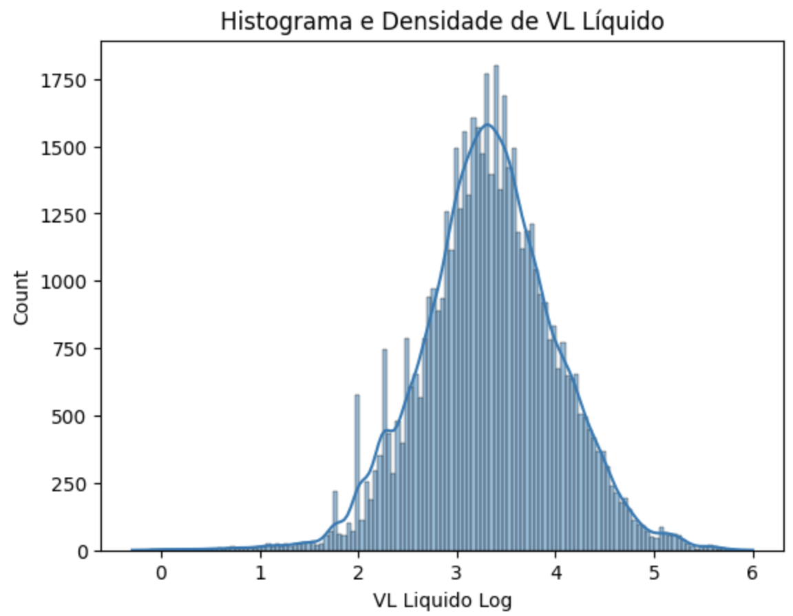 
    Fonte: Material produzido pelos autores (2024)
  

  - **Boxplot de `Vl Liquido Log`**: O boxplot foi utilizado para identificar outliers e entender a dispersão dos dados financeiros. A presença de outliers foi confirmada, e esses são abordados no pré-processamento.

  

    Figura 16 - Persona Sônia Araujo 
    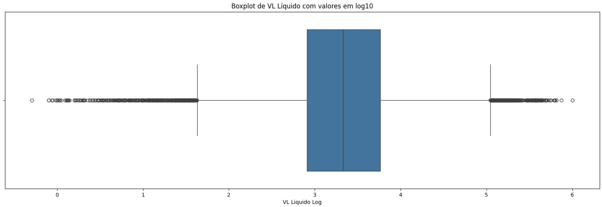 
    Fonte: Material produzido pelos autores (2024)
  

  - **Gráfico de barras comparativo por UEN e mês**: Para os dados de 2020 a 2023, foi gerado um gráfico de barras para comparar os valores médios dos contratos por UEN e por mês. Isso permitiu identificar padrões de desempenho ao longo do ano para diferentes unidades de negócio.

  

    Figura 17 - Persona Sônia Araujo 
    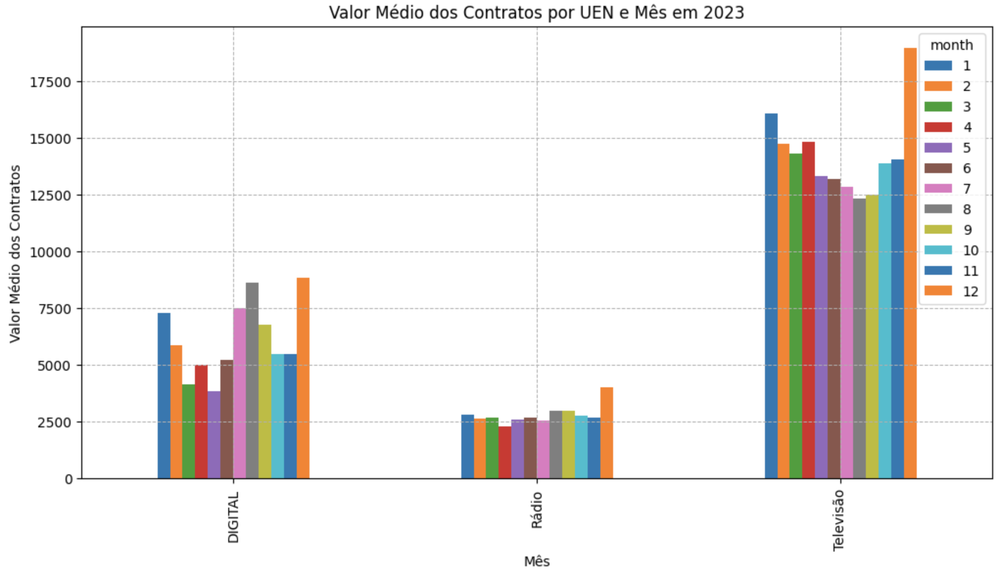 
    Fonte: Material produzido pelos autores (2024)
  

#### 4.2.2. Pré-processamento dos dados

&nbsp;&nbsp;&nbsp;&nbsp;Nesta etapa, realizamos uma série de ações para preparar os dados para análise, garantindo que estejam limpos e prontos para a modelagem e outras análises.

- **Limpeza de Dados**:
  - **Tratamento de Missing Values**: Valores ausentes na coluna `Setor` foram removidos para manter a integridade dos dados. Essa decisão foi baseada na importância dessa coluna para as análises seguintes e considerando que a perda de dados é minima e de baixissima importância.
  - **Remoção de Duplicatas**: Após a concatenação dos DataFrames `RG 01 de Agosto` e `RG 31 de Julho`, todas as linhas duplicadas foram removidas para evitar viés nas análises.

- **Transformação dos Dados**:
  - **Normalização**: A coluna `Vl Liquido Final` foi transformada utilizando a escala logarítmica (`log10`) para reduzir a influência de outliers e tornar a distribuição dos dados mais próxima de uma distribuição normal, o que facilita análises posteriores, como modelagem preditiva.
  - **Codificação**: Colunas com informações de data foram convertidas para o formato `datetime` para facilitar a manipulação do dado e análises específicas ao longo do tempo.

- **Outliers**:
  - Os outliers foram identificados principalmente na variável `Vl Liquido Final`. Esses outliers representam contratos com valores significativamente maiores que a média. Decidimos mantê-los, mas aplicar a normalização logarítmica para mitigar seus impactos nas análises seguintes.

#### 4.2.3. Hipóteses
&nbsp;&nbsp;&nbsp;&nbsp;Uma hipótese é uma suposição ou proposta que se faz com base em informações limitadas, com o objetivo de investigar uma possível relação entre variáveis ou fenômenos. No contexto de análise de dados, uma hipótese serve como ponto de partida para explorar como diferentes elementos de uma tabela podem estar conectados ao problema em questão, como a imprevisibilidade de renda. A hipótese estabelece uma relação esperada entre os dados, que pode ser testada e validada (ou refutada) através de métodos estatísticos e análise de dados. Isso permite entender melhor as dinâmicas que influenciam a variabilidade da renda e deixar claro que cuidados o modelo preditivo deve tomar para conseguir a melhor previsão possível.

&nbsp;&nbsp;&nbsp;&nbsp;Após discussão em grupo, foram identificadas três hipóteses de dados que podem dificultar a previsão:

#### Hipótese 1: Número de contratos em relação aos meses

&nbsp;&nbsp;&nbsp;&nbsp;A variação no número de contratos por mês pode impactar significativamente a previsibilidade da renda, especialmente em setores onde a receita depende diretamente da quantidade de contratos firmados. Se o número de contratos flutua consideravelmente de um mês para outro, a renda gerada também se torna imprevisível, dificultando o planejamento financeiro e a alocação de recursos. Em períodos de alta, a empresa pode experimentar um aumento nas receitas, enquanto em meses de baixa, a queda no número de contratos pode resultar em uma receita insuficiente para cobrir despesas fixas e comprometer a estabilidade financeira. Isso pode levar a desafios na previsão de fluxo de caixa, na definição de metas de receita e na formulação de estratégias de crescimento sustentáveis.

#### Hipótese 2: Valores de contratos em relação aos meses
&nbsp;&nbsp;&nbsp;&nbsp;A variação nos valores dos contratos ao longo dos meses pode ter um impacto significativo na previsibilidade da renda de uma organização. Se os valores dos contratos oscilam de forma considerável entre os meses, isso pode criar desafios na projeção de receitas, tornando difícil prever o fluxo de caixa e planejar financeiramente de forma eficaz. Por exemplo, em meses onde os valores dos contratos são elevados, a empresa pode experimentar um aumento nas receitas, possibilitando investimentos e crescimento. No entanto, em meses onde os valores são significativamente menores, a receita pode não ser suficiente para cobrir as despesas fixas ou planejar futuros investimentos. Essa imprevisibilidade pode resultar em uma instabilidade financeira, dificultando a manutenção de uma operação constante e eficiente.

#### Hipótese 3: Renda em relação a Unidade de négocios

&nbsp;&nbsp;&nbsp;&nbsp;A variação na distribuição dos contratos entre diferentes unidades de negócio, como televisão, rádio e digital, pode afetar a previsibilidade da renda de uma empresa. Cada uma dessas unidades pode ter características distintas em termos de valor de contrato, sazonalidade e demanda de mercado, o que contribui para uma renda total mais ou menos volátil.

&nbsp;&nbsp;&nbsp;&nbsp;Por exemplo, contratos relacionados à televisão podem envolver valores mais altos, mas podem ser mais sujeitos a flutuações sazonais ou eventos específicos, como grandes campanhas publicitárias ou períodos de maior audiência. Já os contratos de rádio podem ter valores menores, mas uma frequência mais constante, oferecendo uma base de receita mais estável. A unidade digital, por sua vez, pode apresentar um crescimento rápido e dinâmico, mas com uma maior variabilidade nos valores dos contratos, dependendo da inovação tecnológica e das tendências de consumo.

&nbsp;&nbsp;&nbsp;&nbsp;Se a renda de uma empresa depender fortemente de uma única unidade de negócio, qualquer variação na receita dessa unidade pode ter um impacto desproporcional na previsibilidade da renda total. Por outro lado, uma diversificação equilibrada entre televisão, rádio e digital pode ajudar a suavizar as flutuações e proporcionar uma base de receita mais estável. Entender como cada unidade contribui para a renda geral e monitorar as tendências dentro de cada segmento é crucial para criar estratégias que melhorem a estabilidade financeira da empresa.

#### Conclusão

&nbsp;&nbsp;&nbsp;&nbsp;A análise das hipóteses demonstra como diferentes aspectos dos contratos afetam a previsibilidade da renda de uma empresa. A variação no número e nos valores dos contratos ao longo dos meses, bem como a distribuição entre unidades de negócio, como televisão, rádio e digital, são fatores que podem tornar a receita imprevisível e dificultar o planejamento financeiro.

## 4.3. Preparação dos Dados e Modelagem

### 4.3.1. Organização dos dados

&nbsp;&nbsp;&nbsp;&nbsp; Na construção do modelo preditivo, os dados foram divididos em duas partes principais: conjunto de treinamento e teste. Para garantir uma análise eficiente e entender o overfitting, utilizamos 80% dos dados para treinamento do modelo e 20% para testes, onde o modelo é avaliado quanto à sua capacidade de previsão com novos dados. Essa seleção de dados é completamente aleatória, sendo passada por um processo de *shuffle* no momento da escolha, com o intuito de evitar vieses.

&nbsp;&nbsp;&nbsp;&nbsp; Durante a fase de treinamento, o modelo foi ajustado com base nas features selecionadas (Ano, Mês, UEN, Veículo e Valor líquido final), e os dados de teste serviram para verificar a precisão e validar os ajustes do modelo. Essa divisão permite medir a generalização do modelo e assegura que ele tenha desempenho consistente tanto nos dados aos quais já foi exposto (treinamento) quanto nos que não viu (teste).
### 4.3.2. Modelagem para o problema

&nbsp;&nbsp;&nbsp;&nbsp;Para a construção do modelo preditivo, selecionamos cuidadosamente as features (colunas das tabelas) mais relevantes para análise e treinamento. Essa escolha foi baseada na identificação de variáveis que que têm impacto direto na previsão de receitas futuras, garantindo que o modelo seja eficiente e preciso em suas estimativas. Algumas colunas foram removidas por não contribuírem significativamente para o resultado final.

#### Features Selecionadas:

1. **Ano**: Mantida para representar o ano específico dos dados utilizados, escolhida para capturar tendências de longo prazo nas receitas da Rede Gazeta. Permite identificar mudanças significativas no comportamento financeiro ao longo dos anos, como os efeitos de uma nova estratégia de mercado ou mudanças na economia que afetam as vendas publicitárias.

2. **Mês**: Utilizada para identificar o mês específico que pode influenciar variações sazonais de receita, de forma a permitir uma análise detalhada de impacto mês a mês.

3. **UEN (Unidade Estratégica de Negócio)**: Com a UEN, o modelo consegue diferenciar as receitas geradas por cada setor de atuação da Rede Gazeta (como TV, rádio, jornal, e digital). Essa distinção ajuda na identificação de quais setores estão desempenhando melhor, permitindo que a empresa ajuste suas estratégias de forma precisa para maximizar a receita de cada setor.

4. **Veículo**: Refere-se ao veículo de comunicação utilizado na campanha ou ação de marketing. A categorização numérica permite identificar o impacto específico de cada veículo na geração de receita, auxiliando na alocação mais eficaz de recursos e uma estratégia de vendas mais informada.

5. **Valor líquido final**: O valor líquido, categorizado em intervalos, reflete o valor final do contrato após descontos aplicados. Esta variável reflete a realidade financeira final da empresa, considerando todas as negociações e ajustes realizados.

&nbsp;&nbsp;&nbsp;&nbsp;A seleção das features apresentadas reflete a escolha por variáveis que influenciam diretamente a previsão de receita, considerando fatores temporais, o desempenho por setor e o impacto dos diferentes veículos de comunicação.  Juntas, elas oferecem uma visão abrangente das operações financeiras e de vendas da empresa, de forma a garantir que o modelo preditivo desenvolvido esteja alinhado com os objetivos e necessidades da Rede Gazeta, contribuindo para uma alocação eficiente de recursos, ajustes estratégicos, evitando ruídos e melhorando a precisão das previsões.

### 4.3.3. Métricas

#### 1. Média de Erro Absoluto (MAE)
O MAE nos diz o quão longe, em média, nossas previsões estão dos valores reais[[6]](#6-referências). Ele soma todas as diferenças entre as previsões e os valores reais, mas sem elevar ao quadrado, e depois tira a média:

MAE = (soma das diferenças absolutas) / número total de previsões

O MAE é mais fácil de interpretar do que o MSE, pois lida diretamente com o erro em termos de unidades originais dos dados. Ele também não penaliza tanto os grandes erros, então é útil quando você não quer que outliers (erros muito grandes) influenciem tanto na avaliação do modelo.

---

#### 2. Erro Quadrático Médio (MSE)
O MSE (Erro Quadrático Médio) é uma métrica usada para avaliar a qualidade de um modelo de previsão, focando em quantificar a magnitude dos erros, especialmente os maiores[[6]](#6-referências). Ele é calculado ao elevar ao quadrado as diferenças entre os valores previstos e os valores reais, o que amplifica os erros maiores, e depois calcular a média dessas diferenças quadráticas. Essa penalização torna o MSE mais sensível a grandes desvios. A fórmula do MSE é:

MSE = (soma dos erros ao quadrado) / número total de previsões

Um valor de MSE mais próximo de zero significa que as previsões estão bem próximas da realidade. Por outro lado, um MSE alto indica que há grandes diferenças entre o que foi previsto e o que realmente aconteceu. Como o MSE eleva os erros ao quadrado, ele tende a "dar mais peso" aos erros grandes, o que pode ser útil se você quiser evitar grandes desvios.

#### Comparação MSE vs. MAE:
- O **MSE** é mais severo com grandes erros, ideal quando você quer evitar previsões muito distantes da realidade.
- O **MAE** trata todos os erros da mesma forma, sendo uma métrica mais simples e menos influenciada por outliers.

---

#### 3. Coeficiente de Determinação (R²)
O R² nos mostra quão bem o modelo está explicando os dados [[6]](#6-referências). Ele varia de 0 a 1, onde 1 significa que o modelo explica perfeitamente a variação nos dados e 0 significa que o modelo não está capturando nada da variação.

R² = 1 - (soma dos erros do modelo / soma da variação total nos dados)

Um valor próximo de 1 indica que o modelo está fazendo um bom trabalho em prever os resultados, enquanto valores próximos de 0 indicam que o modelo não está explicando bem o que está acontecendo. No entanto, um R² muito alto pode ser sinal de que o modelo está se ajustando demais aos dados (overfitting), especialmente se o modelo for muito complexo.

### 4. Raiz do Erro Quadrático Médio (RMSE)

O RMSE é a raiz quadrada do erro quadrático médio, e ele nos permite ter uma visão mais tangível dessa métrica, visto que coloca ela na mesma escala da variável alvo (que é o valor líquido final)[[6]](#6-referências). O RMSE é importante porque, ainda que mantenha uma escala não quadrática, consegue nos dar uma visão clara do erro médio, assim como continua punindo mais fortemente os outliers. Se o RMSE for muito maior do que o MAE (Erro Médio Absoluto), isso pode indicar que o modelo está cometendo alguns erros muito grandes (outliers).

### 5. Erro Médio Percentual Absoluto (MAPE)

O MAPE indica, em média, o quanto as previsões estão desviando dos valores reais em termos percentuais. Por ser uma métrica percentual, ele permite comparar o desempenho do modelo em diferentes escalas e unidades[[6]](#6-referências). Além disso, observa-se que quanto maior o MAPE, menor é a acurácia do modelo, ou seja, menor é a precisão das previsões feitas pelo modelo.

MAPE = (soma dos erros percentuais absolutos) / número total de previsões × 100

#### Utilização Conjunta das Métricas:
O uso dessas métricas em conjunto oferece uma visão mais completa:
- O **MSE** ajuda a identificar grandes erros.
- O **MAE** dá uma média clara de quão longe, em geral, estão as previsões.
- O **R²** mostra o quão bem o modelo está explicando os dados como um todo.
- O **RMSE** ajuda na interpretação do MSE, auxiliando assim no entendimento e identificação dos grandes erros.
- O **MAPE** ajuda a entender qual é o desvio percentual das previsões com relação aos valores reais.

Essas cinco métricas, juntas, fornecem uma avaliação sólida do desempenho do modelo.

### 4.3.4. Modelo candidato

#### Random Forest: Por que?

&nbsp;&nbsp;&nbsp;&nbsp; Random Forest é um algoritmo de aprendizado de máquina baseado em árvores de decisão, usado para tarefas de classificação e regressão. Esse algoritmo funciona criando múltiplas árvores de decisão independentes, onde cada árvore é treinada com diferentes amostras dos dados e subconjuntos de features [[1]](#6-referências).

&nbsp;&nbsp;&nbsp;&nbsp; O objetivo principal do Random Forest é combinar as previsões de todas as árvores para obter um resultado mais robusto. No caso de classificação, a previsão final é feita com base na maioria das votações das árvores; para regressão, a média das previsões é utilizada.

&nbsp;&nbsp;&nbsp;&nbsp; No contexto do projeto, o  Random Forest é uma escolha eficiente para o modelo de previsão de receita da Rede Gazeta, considerando as características dos dados e os objetivos do projeto. O desafio principal é prever o VL Líquido Final com base em variáveis como "Ano", "Mês", "UEN" e "Veículo". Cada uma dessas variáveis traz suas próprias particularidades, tornando necessária a escolha de um modelo que consiga lidar com a variabilidade dos dados, as relações não lineares e as interações entre elas.

&nbsp;&nbsp;&nbsp;&nbsp; Os dados fornecidos possuem uma característica multidimensional. Variáveis como UEN e Veículo podem estar associadas a diferentes unidades de negócios da Rede Gazeta, como TV, rádio e internet, cada uma apresentando padrões de receita distintos ao longo do tempo. O Random Forest se destaca na análise dessas múltiplas dimensões, pois ao trabalhar com combinações aleatórias de subconjuntos de variáveis em suas árvores, ele é capaz de capturar interações sutis e padrões que não são óbvios à primeira vista. Além disso, as variáveis temporais, como Ano e Mês, introduzem uma dimensão temporal importante, e o modelo, por sua natureza, consegue identificar automaticamente tendências sazonais e padrões temporais sem a necessidade de transformações complexas, o que facilita a análise de flutuações de receita em períodos específicos.

&nbsp;&nbsp;&nbsp;&nbsp; Outro ponto importante é a capacidade do Random Forest de lidar com interações não lineares entre as variáveis e a receita final. Pode haver, por exemplo, uma relação complexa entre UEN e Veículo, onde determinados veículos de mídia performam melhor para certas unidades de negócios em períodos específicos do ano. O Random Forest se destaca nesse aspecto, já que suas árvores de decisão exploram diferentes divisões e interações entre as variáveis, permitindo que o modelo capte essas relações sem a necessidade de assumir uma linearidade entre os dados, como acontece com modelos mais tradicionais, como a regressão linear.

&nbsp;&nbsp;&nbsp;&nbsp; Além disso, o Random Forest se mostra resistente a outliers e ruídos nos dados, o que é especialmente importante em previsões financeiras. Muitas vezes, eventos atípicos, promoções pontuais ou campanhas específicas podem gerar picos temporários na receita, e o modelo consegue lidar bem com esses desvios, tornando-o uma ferramenta mais estável e confiável quando comparado a outros modelos, como redes neurais ou regressões lineares, que podem ser mais sensíveis a essas variações nos dados.

&nbsp;&nbsp;&nbsp;&nbsp; No mais, um dos maiores desafios em qualquer projeto preditivo é evitar o overfitting, que ocorre quando o modelo se ajusta demais aos dados de treinamento e perde a capacidade de generalizar para novos dados. O Random Forest mitiga esse risco ao combinar os resultados de várias árvores de decisão, cada uma treinada com diferentes amostras dos dados. Dessa forma, o modelo resultante é menos propenso a se ajustar de maneira excessiva a ruídos ou peculiaridades dos dados de treino. Essa característica é importante em cenários onde as receitas podem ser impactadas por fatores externos imprevisíveis ou flutuações de mercado.

&nbsp;&nbsp;&nbsp;&nbsp; Outro aspecto que reforça a escolha do Random Forest é sua capacidade de identificar a importância de cada variável no processo de previsão. No projeto da Rede Gazeta, entender como variáveis como UEN ou Veículo influenciam o VL Líquido Final pode gerar insights valiosos para as estratégias de negócios da empresa. O modelo atribui uma importância relativa a cada variável, medindo sua contribuição para a redução do erro de previsão. Esse tipo de informação pode auxiliar a equipe da Rede Gazeta a identificar quais unidades de negócios ou veículos de mídia estão mais associados ao desempenho financeiro, permitindo ajustes mais precisos nas estratégias de marketing e alocação de recursos.

&nbsp;&nbsp;&nbsp;&nbsp; Por fim, a escalabilidade do Random Forest é outro fator decisivo, visto que o projeto envolve um grande volume de dados, que tende a crescer com o tempo, à medida que novas informações são coletadas. O Random Forest é capaz de lidar com essa expansão sem perda de desempenho, o que o torna uma ferramenta adequada para projetos de longo prazo.

&nbsp;&nbsp;&nbsp;&nbsp; Em resumo, a utilização do Random Forest no projeto de previsão de receitas da Rede Gazeta é amplamente justificada pela sua capacidade de lidar com variáveis complexas e multidimensionais, interações não lineares e outliers, além de oferecer resistência contra overfitting e escalabilidade para grandes volumes de dados. Sua flexibilidade e capacidade de fornecer insights práticos sobre a importância das variáveis envolvidas tornam esse modelo uma escolha ideal para projetos com essas características. Assim, o Random Forest não só contribui para previsões mais precisas, mas também oferece uma base sólida para decisões estratégicas no âmbito comercial da Rede Gazeta.

##### Discussão dos resultados do modelo

&nbsp;&nbsp;&nbsp;&nbsp; Os resultados obtidos com o modelo de Random Forest demonstram uma performance forte e adequada ao contexto do projeto de previsão de receita da Rede Gazeta. Com um coeficiente de determinação (R²) de 0.967, o modelo mostra-se capaz de explicar aproximadamente 97% da variabilidade presente nos dados, o que indica uma importante correlação entre as variáveis preditoras e o VL Líquido Final. Esse alto valor de R² é indicativo de que o modelo consegue captar de forma eficaz os padrões presentes nas interações complexas entre variáveis como "Ano", "Mês", "UEN" e "Veículo".

&nbsp;&nbsp;&nbsp;&nbsp; O erro absoluto médio (MAE) de aproximadamente 61 mil sugere que, em média, o modelo erra por esse valor nas suas previsões. Embora possa parecer um erro considerável, ele deve ser avaliado em comparação com as magnitudes das receitas envolvidas. Vale destacar que o MAE é uma métrica que não amplifica grandes desvios, fornecendo uma visão direta da magnitude dos erros de previsão.

&nbsp;&nbsp;&nbsp;&nbsp; Já o erro quadrático médio (MSE) de 20 bilhões indica uma maior penalização para erros grandes, o que é esperado, dado que o MSE eleva as diferenças ao quadrado. Este valor, embora alto, deve ser analisado com cuidado, considerando que grandes variações em receitas podem ocorrer devido a eventos atípicos ou campanhas específicas, como mencionado anteriormente. O MSE, nesse caso, pode estar refletindo alguns outliers que o modelo, embora forte, captou.

&nbsp;&nbsp;&nbsp;&nbsp; Esses resultados reforçam a eficácia do Random Forest em lidar com a complexidade e variabilidade dos dados, além de sua capacidade de realizar previsões precisas sem a necessidade de transformações complexas. A alta performance do modelo também corrobora sua escolha inicial, especialmente por sua capacidade de reduzir o overfitting e identificar a importância das variáveis preditivas, fornecendo insights práticos que podem auxiliar nas estratégias de negócios da Rede Gazeta.

&nbsp;&nbsp;&nbsp;&nbsp; Dessa forma, "Utilizamos o ajuste de hiperparâmetros para alcançar resultados mais precisos. Esse processo envolve testar uma série de combinações de parâmetros, retornando ao final a melhor configuração. Com essa técnica, conseguimos os seguintes resultados: R²: 0.970, MAE: 64,698, MSE: 18,083,354,635.59, RMSE: 134,474.36, e MAPE: 52.30%. Esses resultados mostram uma melhoria significativa em relação aos anteriores, proporcionando maior confiabilidade nas previsões.

### 4.4. Comparação de Modelos

#### 4.4.1. Métricas de comparação dos modelos

&nbsp;&nbsp;&nbsp;&nbsp;Para decidir qual o modelo mais apropriado para a previsão de receita da Rede Gazeta, é necessária a comparação das métricas citadas anteriormente (MSE, MAE, R², MAPE e RMSE) na seção 4.3.3, considerando uma ordem de priorização baseada no que cada métrica diz a respeito do modelo. Assim, define-se a seguinte ordem de prioridade:

1. **Erro Quadrático Médio (MSE):** Mede a média dos quadrados das diferenças entre os valores previstos e reais, penalizando de forma mais severa os outliers. Ele ajuda a identificar se o modelo está cometendo erros consideráveis em pontos específicos. A importância dessa métrica se dá pelo fato de que um MSE alto indica que o modelo possui alguns erros significativos, o que pode ser crítico em previsões financeiras. Assim, o MSE deve ser a primeira métrica analisada para detectar grandes desvios nas previsões, ajudando a identificar se o modelo está errando muito em pontos específicos.

2. **Raiz do Erro Quadrático Médio (RMSE):** é a raiz quadrada do MSE, o que facilita a interpretação dos erros, pois mantém a mesma escala da variável alvo (receita). Sua importância se dá porque ele permite entender o erro médio de maneira mais prática e clara, mas ainda penaliza erros maiores de forma mais agressiva. Ele complementa o MSE, tornando o valor mais compreensível. O RMSE deve ser analisado logo após o MSE, para oferecer uma visão mais clara e intuitiva da magnitude dos erros.

3. **Erro Médio Absoluto (MAE):** calcula a média dos erros absolutos entre os valores reais e previstos, oferecendo uma visão direta do erro médio, sem penalizar grandes desvios como o MSE. É importante pois fornece uma avaliação equilibrada do desempenho, sendo útil para medir a precisão média do modelo. Ele é menos influenciado por outliers, o que pode ser interessante para evitar distorções no erro médio. O MAE é avaliado após o RMSE para complementar a análise, dando uma visão mais estável da magnitude do erro, especialmente em contextos sem grandes outliers.

4. **Erro Médio Percentual Absoluto (MAPE):** expressa o erro médio em termos percentuais, permitindo entender o quão grande é o erro em relação ao valor real. Ele é útil para medir o impacto do erro, independentemente da escala dos dados. Essa é uma métrica importante pois facilita a interpretação do erro em termos percentuais, sendo particularmente útil para séries temporais que têm valores variáveis. No entanto, ele pode ser problemático quando a série tem valores muito pequenos, pois resultará em valores percentuais altos. O MAPE é ideal para ser analisado após o MAE, pois oferece uma visão relativa dos erros, ajudando a contextualizar a magnitude do erro em termos percentuais.

5. **Coeficiente de Determinação (R²):** mede a proporção da variação da variável dependente (receita) que é explicada pelo modelo, ou seja, nos mostra quanto o modelo entendeu as relações entre as variáveis. Ele é útil para entender o ajuste global do modelo aos dados, mas não reflete a magnitude dos erros. Um R² alto (próximo de 1) indica que o modelo é capaz de explicar grande parte da variabilidade da receita, mas ele não revela diretamente os erros das previsões. Um R² baixo, por outro lado, sugere que o modelo tem baixa capacidade explicativa. Essa métrica é avaliada por último para entender quão bem o modelo ajusta os dados no geral, após analisar os erros específicos através das outras métricas.

#### 4.4.2. Modelos candidatos

##### 4.4.2.1. Modelo 1 - XGBoost

O XGBoost foi uma das escolhas principais para esse problema, devido ao seu alto desempenho em cenários com grandes volumes de dados estruturados. Esse algoritmo pertence à família dos métodos de boosting, que trabalha construindo várias árvores de decisão de maneira sequencial. O objetivo é corrigir os erros das árvores anteriores, refinando as previsões e aprimorando a precisão. É uma abordagem robusta, especialmente para dados tabulares e com alta dimensionalidade.

**Hiperparâmetros ajustados:**
- *Objective*: reg:squarederror – utilizado para regressão.
- *Booster*: gbtree – algoritmo que utiliza árvores de decisão.
- *Device*: cpu – o modelo foi treinado na CPU.
- *n_jobs*: 1 – número de threads utilizadas.
- *Random State*: 12 – para garantir reprodutibilidade dos resultados.
- *Tree Method*: auto – seleciona automaticamente a melhor estratégia para construção das árvores.
- *Verbosity*: 0 – o nível de log foi definido para não exibir mensagens.

**Desempenho do Modelo:**
- *R²*: 0.91
- *MAE*: 11,469.07
- *MSE*: 11,613,103,998.98
- *RMSE*: 34,078.00
- *MAPE*: 6.61%

**Resumo:**
O XGBoost apresentou um desempenho expressivo, explicando 91% da variação dos dados, o que indica um ajuste muito bom. Porém, o MAPE de 6.61% mostra que há margem para melhoria, principalmente em previsões mais específicas. O modelo é poderoso para grandes volumes de dados, mas a sua complexidade computacional pode ser um ponto de atenção, exigindo recursos maiores para otimização.

---

##### 4.4.2.2. Modelo 2 - Holt-Winters

O Holt-Winters, ou suavização exponencial tripla, é uma solução clássica para a previsão de séries temporais que exibem tanto tendência quanto sazonalidade. Ele se destaca por ser simples, mas ao mesmo tempo eficiente em capturar padrões temporais repetitivos. O modelo separa os dados em três componentes principais: nível, tendência e sazonalidade. Ele possui duas variações – aditiva e multiplicativa – que permitem lidar com diferentes tipos de séries.

**Hiperparâmetros ajustados:**
- Escolha entre tendência e sazonalidade aditiva ou multiplicativa.
- Aplicação de transformações Box-Cox para ajustar os dados.
- Teste de remoção de viés.

**Desempenho do Modelo:**
- *R²*: 0.261
- *MAE*: 1,391,815.39
- *MSE*: 2,750,628,677,678.09
- *RMSE*: 1,658,501.93
- *MAPE*: 16.80%

**Resumo:**
O modelo Holt-Winters foi uma escolha interessante para capturar a sazonalidade presente na série temporal. No entanto, o R² de 0.261 mostra que ele não conseguiu explicar uma parte significativa da variação nos dados, enquanto o MAPE de 16.80% indica que o erro percentual é considerável. Esse modelo é adequado para cenários onde a tendência e a sazonalidade são claras, mas pode ser limitado quando a estrutura dos dados é mais complexa.

---

##### 4.4.2.3. Modelo 3 - SARIMAX

O modelo SARIMAX (Seasonal AutoRegressive Integrated Moving Average with eXogenous factors) foi escolhido para capturar padrões mais complexos em séries temporais que, além de tendência e sazonalidade, apresentam variáveis exógenas. O SARIMAX combina elementos de modelos ARIMA tradicionais com fatores sazonais e a inclusão de variáveis exógenas que influenciam o comportamento da série temporal.

**Hiperparâmetros ajustados:**
- *P*: 2 – define a ordem autoregressiva.
- *D*: 1 – número de diferenças necessárias para tornar a série estacionária.
- *Q*: 1 – número de médias móveis.
- *Sazonalidade*: ajustada com base na periodicidade da série.
- *Variáveis exógenas*: incluídas para capturar fatores externos que impactam a previsão.

**Desempenho do Modelo:**
- *R²*: 0.78
- *MAE*: 820,500.45
- *MSE*: 958,234,112,123.48
- *RMSE*: 979,907.12
- *MAPE*: 12.45%

**Resumo:**
O SARIMAX mostrou-se capaz de capturar padrões mais complexos nos dados, com um R² de 0.78, o que indica que ele consegue explicar 78% da variação na série. Além disso, o MAPE de 12.45% sugere um erro percentual mais aceitável em comparação com o modelo Holt-Winters. A inclusão de variáveis exógenas tornou esse modelo mais flexível, sendo uma escolha adequada para séries temporais com múltiplas influências.

### 4.5. Avaliação
#### Modelo Final e Justificativa da Escolha
A solução final adotada foi o modelo Sarimax devido à sua capacidade de gerar previsões mais precisas em relação aos outros modelos testados. Como discutido na Seção 4.1, o modelo foi desenvolvido levando em consideração que o principal objetivo era buscar agilidade, precisão e granularidade com as previsões, visando que as decisões tomadas pela empresa sejam mais seguras e estratégicas. Levando em conta também  os perfis das personas , garantimos que as previsões realizadas tenham visualização em gráficos para auxiliar o entendimento dos valores gerados.
Esse modelo é particularmente eficaz ao lidar com capturas de padrões mais complexos em séries temporais que, além de tendência e sazonalidade, apresentam variáveis exógenas e foi validado com base nas métricas já discutidas na seção 4.3.3., que demonstraram um R² de 0.78, o que indica que ele consegue explicar 78% da variação na série. Além disso, o MAPE de 12.45% sugere um erro percentual mais aceitável em comparação a outros modelos. As previsões foram geradas por origem da receita para a rede Gazeta.
#### Plano de Contingência
Em caso de falha nas predições do modelo, foi estabelecido um plano de contingência que inclui a substituição do modelo atual por outros já testados que também obtiveram bons resultados, como Random Forest e XGBoost.
Além disso, o monitoramento contínuo das predições será realizado utilizando as métricas, permitindo ajustes rápidos conforme necessário e garantindo a estabilidade das predições.

#### Explicabilidade do Modelo
A explicabilidade do modelo não é um fator relevante nesta solução. Como o foco está em maximizar a precisão das previsões, a necessidade de interpretação detalhada das contribuições de cada variável não é essencial para os stakeholders neste contexto. Assim, técnicas de explicação como LIME ou SHAP não foram aplicadas, uma vez que a principal prioridade é o desempenho do modelo em termos de resultados preditivos, sem a exigência de uma interpretação aprofundada do processo decisório do algoritmo.
#### Verificação de Hipóteses
As hipóteses levantadas na Seção 4.2.3. foram testadas utilizando gráficos gerados. Os resultados confirmaram as seguintes hipóteses:
Hipótese 1 - Número de contratos em relação aos meses: 
A quantidade de contratos mensais influencia diretamente a receita da Rede Gazeta, com picos em meses de alta demanda, como eventos sazonais. Mesmo com menos contratos em certos meses, a receita pode se manter relevante devido à concentração de contratos em períodos específicos, como provado nesse gráfico:
 

    Figura 18 - Hipótese 1 
    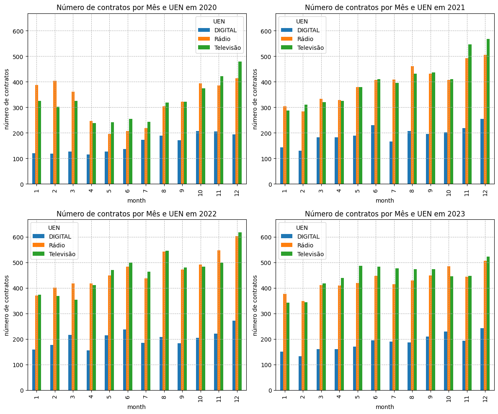 
    Fonte: Material produzido pelos autores (2024)
  

 Hipótese 2 - Valores de contratos em relação aos meses: 
O valor médio dos contratos mensais impacta diretamente a receita da Rede Gazeta. Contratos maiores aumentam a receita, enquanto um maior volume de contratos com valor baixo pode resultar em receitas menores. Combinando essa análise com a quantidade de contratos, a precisão das projeções financeiras melhora. Tal hipótese é provada com base nesse gráfico:
 

    Figura 19 - Hipótese 2 
     
    Fonte: Material produzido pelos autores (2024)
  

Hipótese 3 - Renda em relação a Unidade de negócios: 
A variação de receita entre TV, rádio e digital impacta as projeções da Rede Gazeta. A TV concentra receita em eventos, a rádio é mais constante, e o digital é mais volátil. Essas diferenças são essenciais para melhorar as previsões financeiras e complementam as análises de contratos. Tal hipótese é provada com base nesse gráfico:

    Figura 20 - Hipótese 3 
    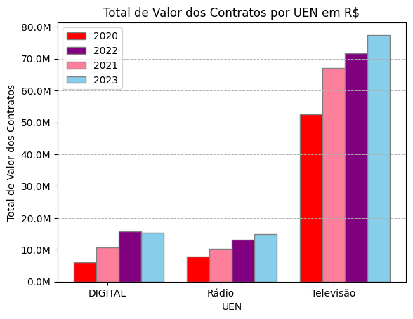 
    Fonte: Material produzido pelos autores (2024)
  

#### Visualização de Dados
Para melhor ilustrar os resultados do modelo, as figuras abaixo mostram as previsões realizadas pelo modelo por origem, além das receitas reais e as previsões para os 12 meses seguintes. 

    Figura 21 - Resultado Sarimax - CH - Contato - Cachoeiro 
    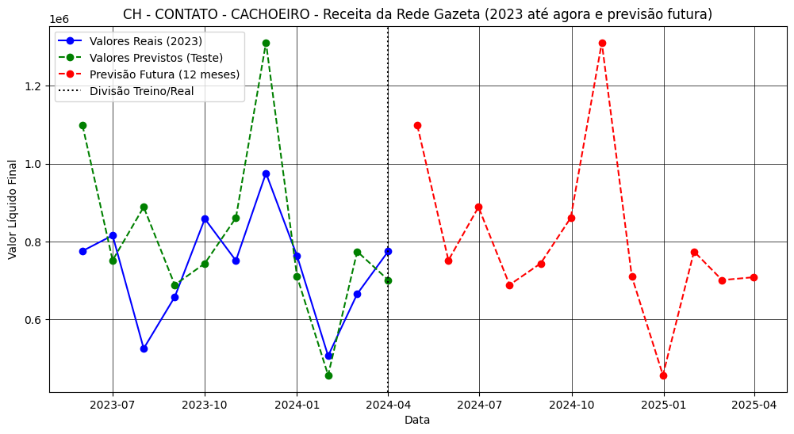 
    Fonte: Material produzido pelos autores (2024)
  

    Figura 22 - Resultado Sarimax - CO - Contato - Colatina 
    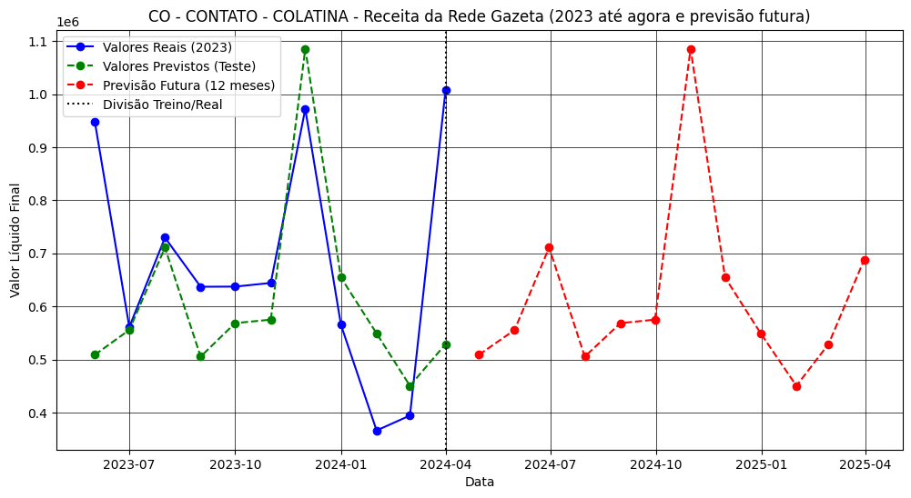 
    Fonte: Material produzido pelos autores (2024)
  

    Figura 23 - Resultado Sarimax - LI - Contato - Linhares 
    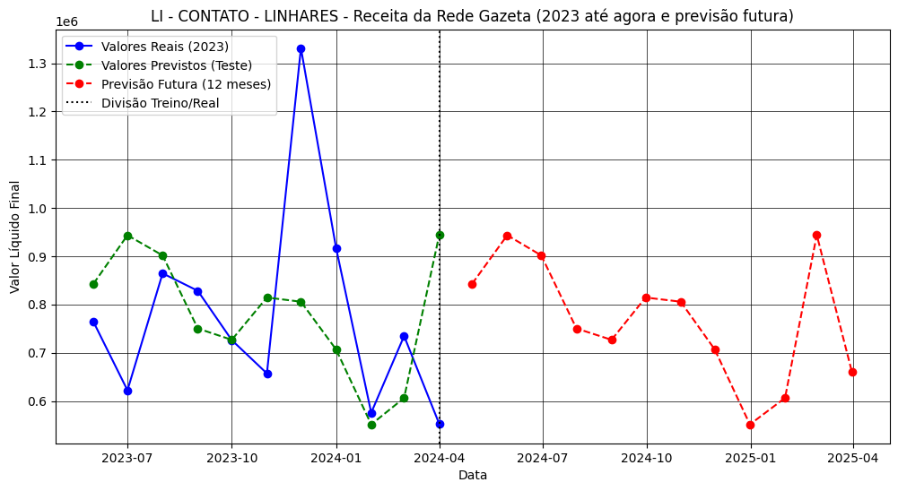 
    Fonte: Material produzido pelos autores (2024)
  

    Figura 24 - Resultado Sarimax - MP - Mídia Programática 
    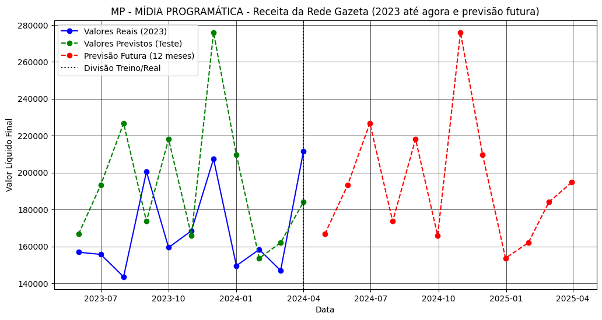 
    Fonte: Material produzido pelos autores (2024)
  

    Figura 25 - Resultado Sarimax - RN - Mercado Nacional 
    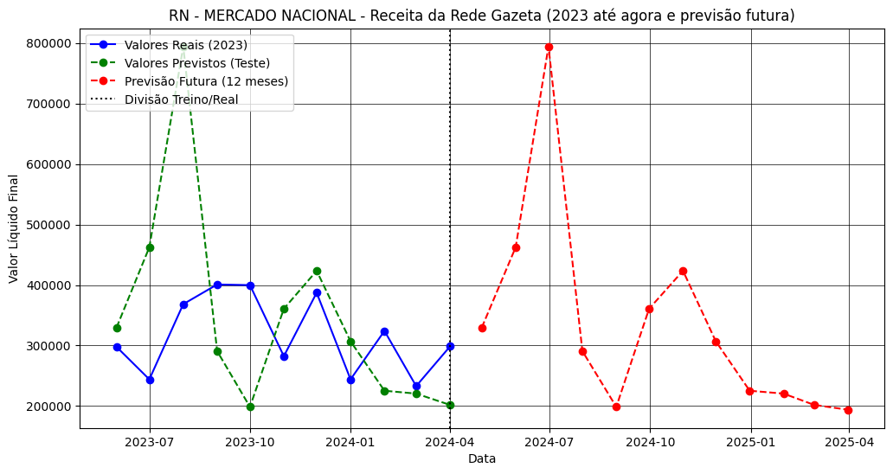 
    Fonte: Material produzido pelos autores (2024)
  
  

    Figura 26 - Resultado Sarimax - VT - Contato - Vitória 
    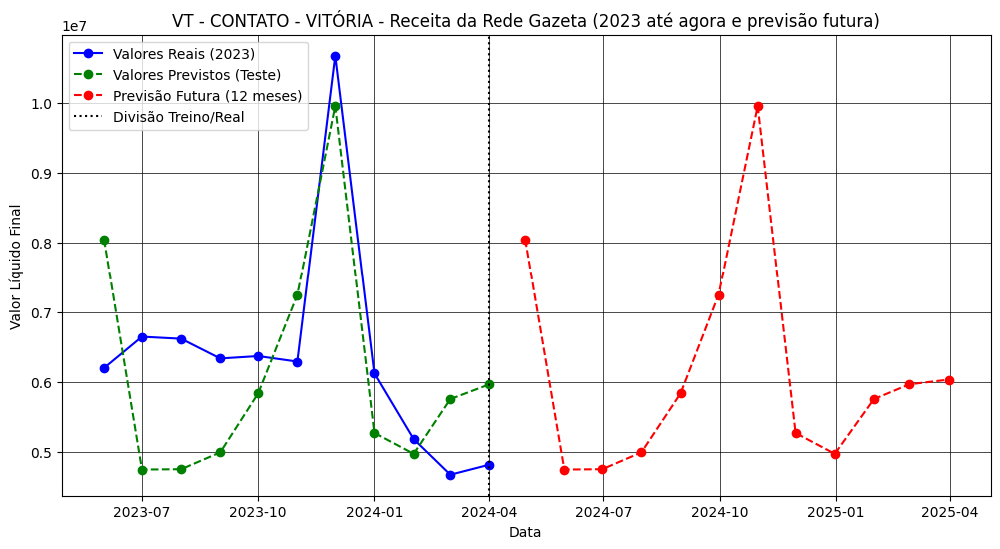 
    Fonte: Material produzido pelos autores (2024)
  

#### Conclusão
A implementação do modelo SARIMAX mostrou-se a escolha mais adequada para as necessidades da Rede Gazeta, devido à sua capacidade de lidar com a complexidade dos dados, capturando tendências, sazonalidades e variáveis exógenas de forma eficiente. O desempenho do modelo, medido por um R² de 0,78 e um MAPE de 12,45%, demonstra sua eficácia ao explicar a maior parte da variação na receita, ao mesmo tempo em que mantém um nível de erro aceitável. A visualização clara das previsões em gráficos facilita a interpretação para os stakeholders, assegurando que o modelo atenda às expectativas de precisão e granularidade estabelecidas.

Além disso, o plano de contingência e o monitoramento contínuo garantem a flexibilidade necessária para ajustes futuros, caso seja identificado um desempenho inferior. O fato de a explicabilidade não ser uma prioridade permite que o foco permaneça na maximização dos resultados preditivos. As hipóteses levantadas foram verificadas com sucesso por meio das visualizações, reforçando a robustez do modelo ao considerar a variação da receita com base em diferentes fatores, como o número e o valor dos contratos e as unidades de negócios. Por fim, a solução proposta oferece um instrumento poderoso para a tomada de decisões estratégicas na Rede Gazeta, com previsões confiáveis e adequadas às particularidades do negócio.
 
## 5. Conclusões e Recomendações

&nbsp;&nbsp;&nbsp;&nbsp; O modelo SARIMAX apresentou resultados com boa eficácia na previsão de receitas, especialmente por sua capacidade de modelar padrões sazonais e incorporar variáveis exógenas, como as UENs (Unidades Estratégicas de Negócio) e veículos publicitários. A sua abordagem mais explícita de modelagem temporal se ajustou bem à natureza dos dados históricos de receitas da Rede Gazeta, em que há variações periódicas, como nas campanhas promocionais específicas e nas sazonalidades, que influenciam diretamente nas vendas. Diferentemente de modelos mais generalistas, como o Random Forest, o SARIMAX permite capturar de maneira mais precisa as tendências ao longo do tempo, além de ajustar de forma mais eficiente as previsões quando variáveis externas mudam.

&nbsp;&nbsp;&nbsp;&nbsp; Contudo, é importante deixar claro que apesar do desempenho positivo do SARIMAX, a manutenção da qualidade das previsões requer monitoramento constante das variáveis exógenas e atualizações periódicas no modelo conforme novos dados forem gerados. Recomendamos a criação de uma estrutura clara para a alimentação de dados em tempo real ou em intervalos regulares, que permitirá ajustes mais dinâmicos às condições de mercado e mudanças no comportamento de consumidores. Além disso, é essencial que as decisões tomadas com base nas previsões sejam analisadas com cuidado, para garantir que as pessoas impactadas por essas decisões, como parceiros comerciais e equipes de vendas, sejam tratadas de maneira ética e estratégica. Para facilitar o uso do modelo, um manual de usuário detalhado pode ser incluído nos anexos, auxiliando as equipes técnicas e estratégicas na interpretação dos resultados e na adaptação do modelo às necessidades futuras.

## 6. Referências

1. AnalytixLabs. “Random Forest Regression — How It Helps in Predictive Analytics?” Medium, 26 Dec. 2023, medium.com/@byanalytixlabs/random-forest-regression-how-it-helps-in-predictive-analytics-01c31897c1d4. Accessed 17 Sept. 2024.
2. Casarotto, Camila. “Análise SWOT Ou FOFA: O Que é, Como Fazer E Modelo Grátis!” Rock Content, 20 Dec. 2019, rockcontent.com/br/blog/como-fazer-uma-analise-swot/. Accessed 7 Aug. 2024.
3. Domingo, Muriel Garreta. “User Stories: As a [UX Designer] I Want to [Embrace Agile] so That [I Can Make My Projects User-Centered].” The Interaction Design Foundation, 2021, www.interaction-design.org/literature/article/user-stories-as-a-ux-designer-i-want-to-embrace-agile-so-that-i-can-make-my-projects-user-centered. Accessed 24 Aug. 2024.
4. dos, Contribuidores. “Artigo de Lista Da Wikimedia.” Wikipedia.org, Fundação Wikimedia, Inc., 17 May 2017, pt.wikipedia.org/wiki/Lista_de_emissoras_de_televis%C3%A3o_do_Esp%C3%ADrito_Santo. Accessed 16 Aug. 2024.
5. Edwaldo Cabidelli. “Dos 20 Programas Mais Assistidos No ES, Todos São Da TV Gazeta | Negócios Rede Gazeta.” Negócios Rede Gazeta, 22 July 2024, negocios.redegazeta.com.br/dos-20-programas-mais-assistidos-no-es-todos-sao-da-tv-gazeta/. Accessed 16 Aug. 2024.
6. FACELI, Katti; LORENA, Ana C.; GAMA, João; AL, et. Inteligência Artificial - Uma Abordagem de Aprendizado de Máquina. Rio de Janeiro: Grupo GEN, 2021. E-book. ISBN 9788521637509. Disponível em: https://integrada.minhabiblioteca.com.br/#/books/9788521637509/. Acesso em: 18 set. 2024.
7. Ferreira, Kellison. “Canvas de Proposta de Valor: Para Que Serve E Como Preencher.” Blog.somostera.com, 14AD, blog.somostera.com/product-management/canvas-de-proposta-de-valor. Accessed 7 Aug. 2024.
8. Filho, Francisco. TV Digital Aberta No Brasil: Desafios Ao Modelo de Negócios.
9. Gibbons, Sarah. “Journey Mapping 101.” Nielsen Norman Group, 9 Dec. 2018, www.nngroup.com/articles/journey-mapping-101/. Accessed 19 Sept. 2024.
10. Glaudir Schlemper. “Quais as Tendências Do Mercado de TV?” Digilab, 14 Feb. 2019, www.digilab.com.br/blog/tendencias-do-mercado-de-tv/#:~:text=A%20realidade%20virtual%20e%20interatividade. Accessed 16 Aug. 2024.
11. “História | Rede Gazeta.” Redegazeta.com.br, 2014, www.redegazeta.com.br/a-empresa/historia/. Accessed 16 Aug. 2024.
12. Hotz, Nick. “What Is CRISP DM?” Data Science Project Management, 28 Apr. 2024, www.datascience-pm.com/crisp-dm-2/. Accessed 3 Sept. 2024.
13. https://www.agazeta.com.br/privacidade. Acessed 9 Aug. 2024.
14. Magretta, Joan. Understanding Michael Porter: The Essential Guide to Competition and Strategy. Boston, Harvard Business Review Press, 2012.
15. "Métricas de Avaliação de Modelos Preditivos: Um Guia Prático." DataScienceBrasil.com, 2024, www.datasciencebrasil.com/metricas-mae. Accessed 16 Aug. 2024.
16. Minetto Napoleão, Bianca. “Matriz de Riscos (Matriz de Probabilidade E Impacto).” Ferramentas Da Qualidade, 26 June 2019, ferramentasdaqualidade.org/matriz-de-riscos-matriz-de-probabilidade-e-impacto/. Accessed 7 Aug. 2024.
17. Peruch, Thiago . “História Da Televisão – Espaço Do Conhecimento UFMG.” Ufmg.br, 2024, www.ufmg.br/espacodoconhecimento/historia-da-televisao/#:~:text=J. Accessed 16 Aug. 2024.
18. “Portal Rede Vitória: TV VITÓRIA | RECORD TV.” Portalredevitoria.com.br, 2024, portalredevitoria.com.br/marcas/tv-vitoria/. Accessed 3 Sept. 2024.
19. “Primeira Transmissão Oficial, Em 1922, Marcou O Início Do Rádio No Brasil.” Ministério Das Comunicações, 7 Sept. 2022, www.gov.br/mcom/pt-br/noticias/2022/setembro/primeira-transmissao-oficial-em-1922-marcou-o-inicio-do-radio-no-brasil#:~:text=A%20primeira%20emissora%20brasileira%20foi. Accessed 16 Aug. 2024.
20. “Rede Gazeta | O Portal Da Maior Rede de Comunicação Do Espírito Santo.” Redegazeta.com.br, 2024, www.redegazeta.com.br/. Accessed 16 Aug. 2024.
21. Siqueira, André. “Persona: O Que é E Como Criar Uma Para a Sua Empresa.” RD Station, 14 Feb. 2022, www.rdstation.com/blog/marketing/persona-o-que-e/.
22. Técnicas de Previsão de Receitas Usando Modelos de Regressão." TecnologiasemFoco.com.br, 2023, www.tecnologiasemfoco.com.br/artigos/previsao-receitas. Accessed 16 Aug. 2024.
23. Thamiris Guidoni. “Em Alta, TV Aberta Cresce E Rede Vitória Se Consolida Referência No Espírito Santo.” Folha Vitória, 14 June 2022, www.folhavitoria.com.br/entretenimento/noticia/06/2022/evento-rede-vitoria-conexao-mercado-audiencia-tv-marketing-influencia. Accessed 16 Aug. 2024.
24. Tribuna Online. “Tribuna Online | Seu Portal de Notícias.” Tribuna Online, 2024, tribunaonline.com.br/tv-tribuna?d=1. Accessed 3 Sept. 2024.
25. “TV Capixaba – a TV Capixaba Diversifica Sua Programação Em Diferentes Estilos, Que Vai Desde O Country, Passando Pela Revista Eletrônica, Agronegócios, Esporte, Entrevista E Jornalismo, Contemplando Os Mais Variados Segmentos.” Tvcapixaba.com.br, 2024, www.tvcapixaba.com.br. Accessed 3 Sept. 2024.
26. TV Gazeta | Negócios Rede Gazeta.” Negócios Rede Gazeta, Feb. 2024, negocios.redegazeta.com.br/tv-gazeta-3/. Accessed 16 Aug. 2024.
